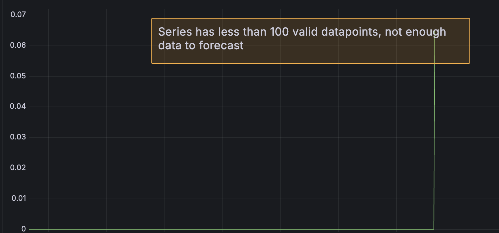

https://grafana.com/docs/grafana-cloud/machine-learning/dynamic-alerting/forecasting/

* goal
  * | Grafana Cloud,
    * create forecasts
    * view forecasts 

* forecast
  * tuning
    * percentile
    * up & low limits
  * uses
    * query / has MANY DIFFERENT ( >100 hits) values

      

# _Examples:_
## requirements
* ⚠️[Grafana Cloud](https://play.grafana.org/a/grafana-ml-app/metric-forecast/3d95ad72-efe3-446a-8e99-e43854e213d4)⚠️
* [Editor or Admin basic role](https://grafana.com/docs/grafana/latest/administration/roles-and-permissions/)
  * | Grafana sandbox,
    * ❌NOT enough rights❌
## create a forecast
* steps
  * AI & machine learning > Metric Forecasts > New Forecaste
  * datasource: `grafanacloud-usage`
  * query: 
    * `sum(grafanacloud_org_metrics_included_series)`
      * ❌NOT sense❌
        * Reason:🧠ONLY 1! value🧠
    * `grafanacloud_instance_queries_per_second`
  * next
  * adjust forecast tuning
  * percentile
  * yhat
    * == low & upper limits

## view forecasts
* [Grafana Sandbox](https://play.grafana.org/a/grafana-ml-app/metric-forecast)
  * training runs & window
  * forecasted values
