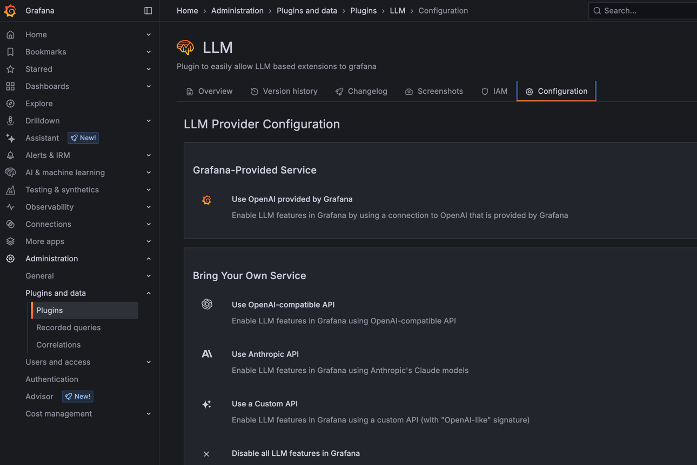

https://grafana.com/docs/grafana-cloud/machine-learning/llm/llm-setup/

* requirements
  * Grafana cloud
    * ❌NOT | Grafana oss❌
  * Admin role

* steps to configure
  * set URL & API key

# _Examples:_
## NOT | Grafana oss
* `docker run -d --name=grafana -p 3000:3000 grafana/grafana-oss`
  * http://localhost:3000/
    * Administration > Plugins > llm -- ❌NOT found❌
