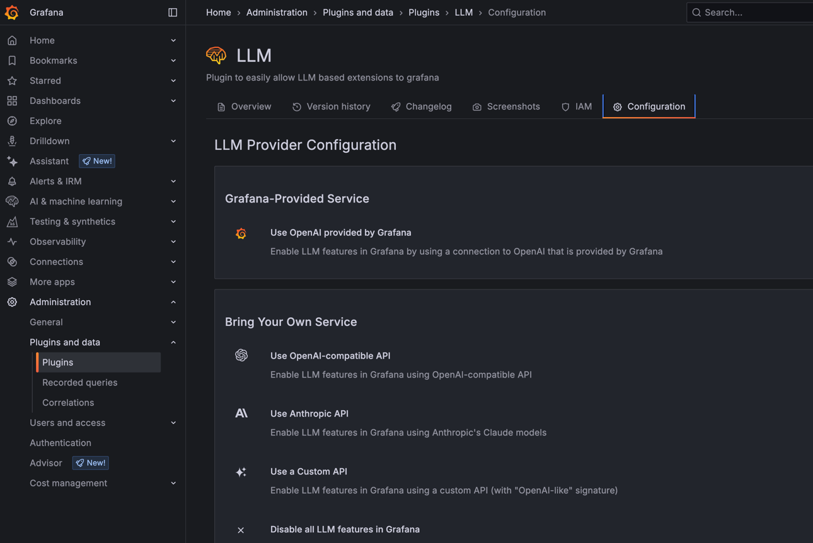

https://grafana.com/docs/grafana-cloud/machine-learning/llm/

* goal
  * Grafana LLM app

* Grafana LLM app
  * allows
    * 👀centralizing access -- to -- LLM services | Grafana👀
      * == proxy -- to -- LLMs
    * real-time streaming interactions | Grafana
      * == recommendations / EACH keyword
  * by default,
    * ❌NOT enabled❌
  * steps to enable
    * Administration > Plugins and data > Plugins > LLM

# _Examples:_
## view
* Grafana cloud
