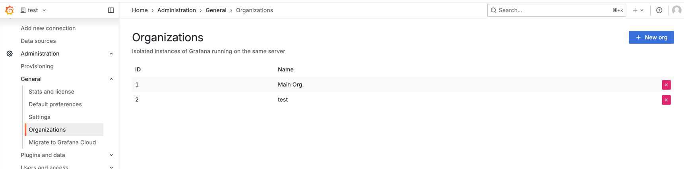
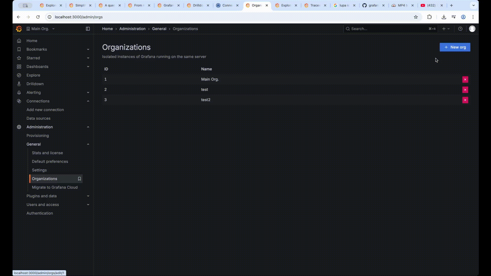
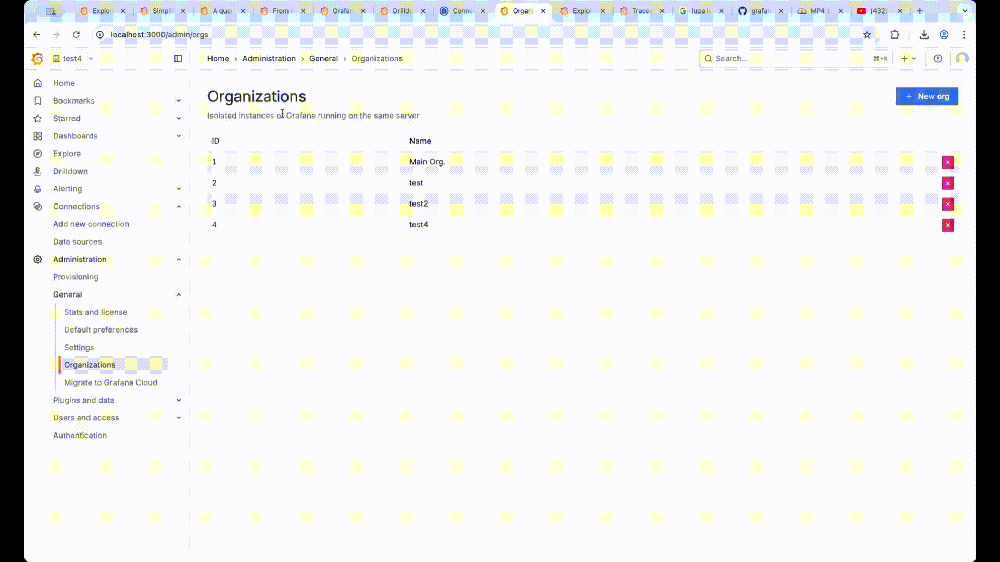

# requirements
* `docker run -d -p 3000:3000 grafana/grafana`
* Grafana Server Administrator permissions

# View organizationS

* http://localhost:3000/admin/orgs
  * **Administration** > **General** > **Organizations**

# Create organization 
* http://localhost:3000/admin/orgs
  * **Administration** > **General** > **Organizations** > New organization

  

# Delete organization
* http://localhost:3000/admin/orgs
  * **Administration** > **General** > **Organizations** > Delete organization

# Edit organization
* http://localhost:3000/admin/orgs
  * **Administration** > **General** > **Organizations** > Edit organization

  
