---
aliases:
  - change-home-dashboard/
  - preferences/
  - preferences/change-grafana-name/
  - preferences/change-grafana-theme/
  - preferences/change-grafana-timezone/
  - preferences/change-home-dashboard/
labels:
  products:
    - enterprise
    - oss
title: Organization preferences
weight: 500
---

# Organization preferences

* Grafana preferences
  * == basic settings / manage UI theme + home dashboard + time zone
  * levels
    * lowest level' precedence > highest level' precedence 
    * types
      - **Server -** 
        - affects ALL users | Grafana server
        - set by a [Grafana server admin](../roles-and-permissions/#grafana-server-administrators)
      - **Organization -**
        - affects ALL users | organization
        - set by an [Organization admin](../roles-and-permissions/#organization-roles)
      - **Team -**
        - affects ALL team's users 
        - set by an [Organization Admin or Team Admin](../roles-and-permissions/#teams-and-permissions)
      - **User account -**
        - affects the individual user
        - set by the user | their own account

## Change Grafana name and email

### Change organization name

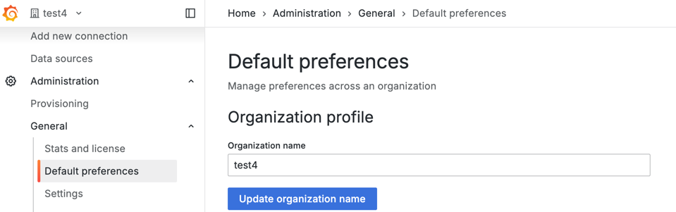

### Change team name or email

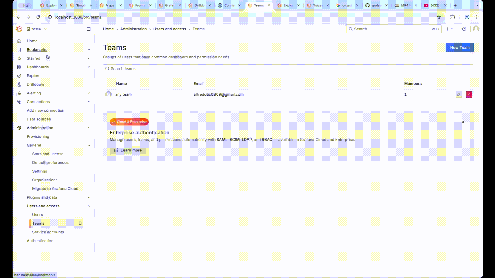

### Change user name or email

* see [Edit your profile](../user-management/user-preferences/#edit-your-profile)

## Change Grafana UI theme

* ways to change
  * | Grafana's settings
    
    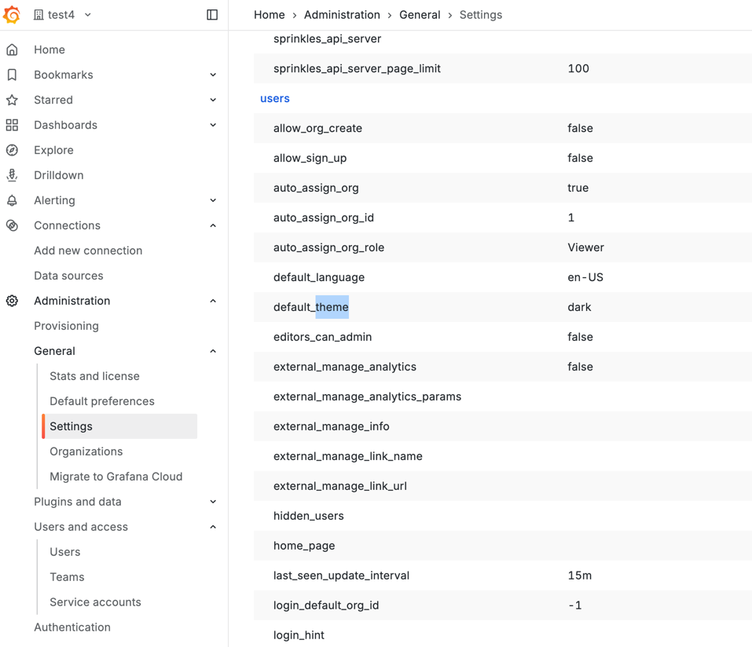
  * | Grafana > General > Default preferences

    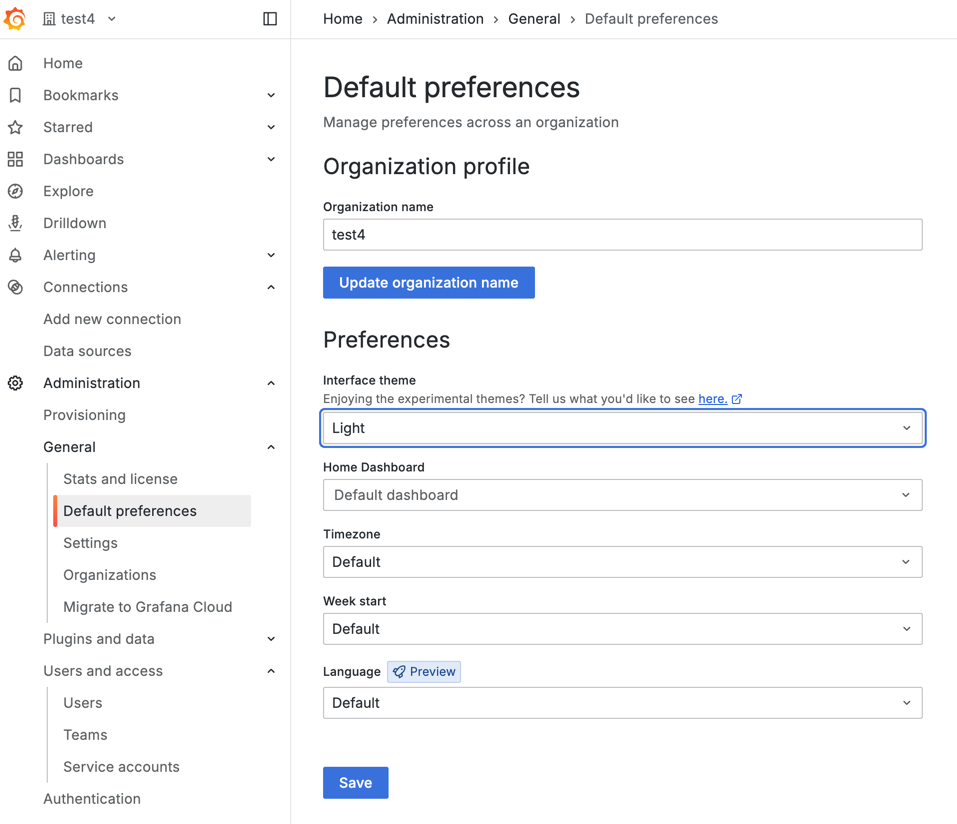

### Theme options

* impact
  * Grafana's graphs, menus, other UI elements

#### Default

* **Default**
  * ALLOWED values
    * dark theme
    * theme / selected | higher level

#### Dark


#### Light

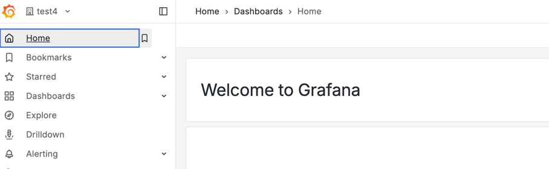

#### Experimental

* experimental themes

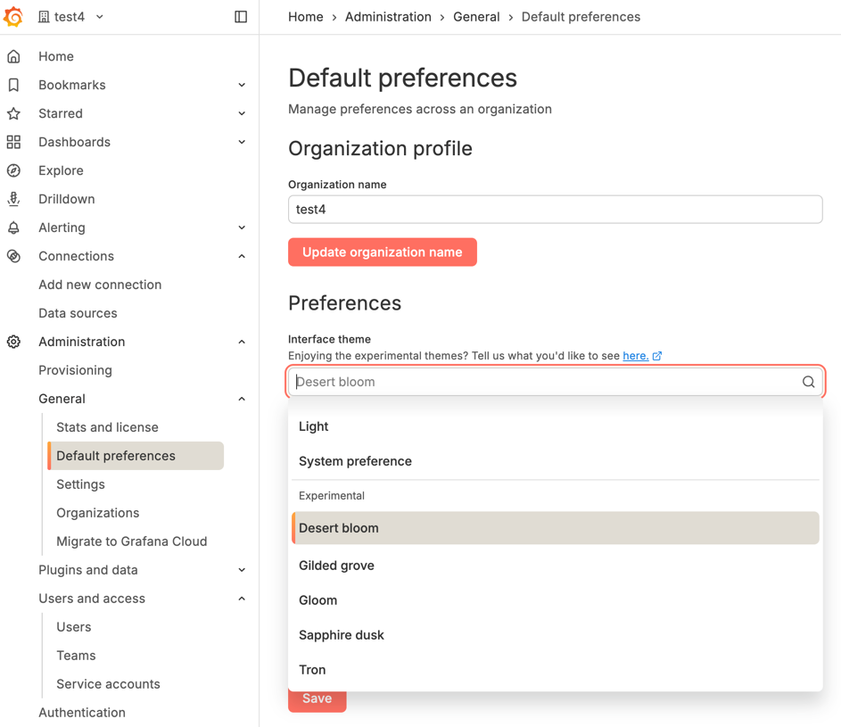

### Change server UI theme

* requirements
  * Grafana server administrator

* [default Grafana UI theme](../../setup-grafana/configure-grafana/_index.md#default_theme)
  * affect ALL users

* [View server settings](../stats-and-license/#view-server-settings)

### Change organization UI theme

* affects ALL organization's users 

* **Administration** > **General** > **Default preferences** > UI theme

### Change team UI theme

* **Administration** > **Users and access** > **Teams** > choose 1 > **Settings** > UI theme

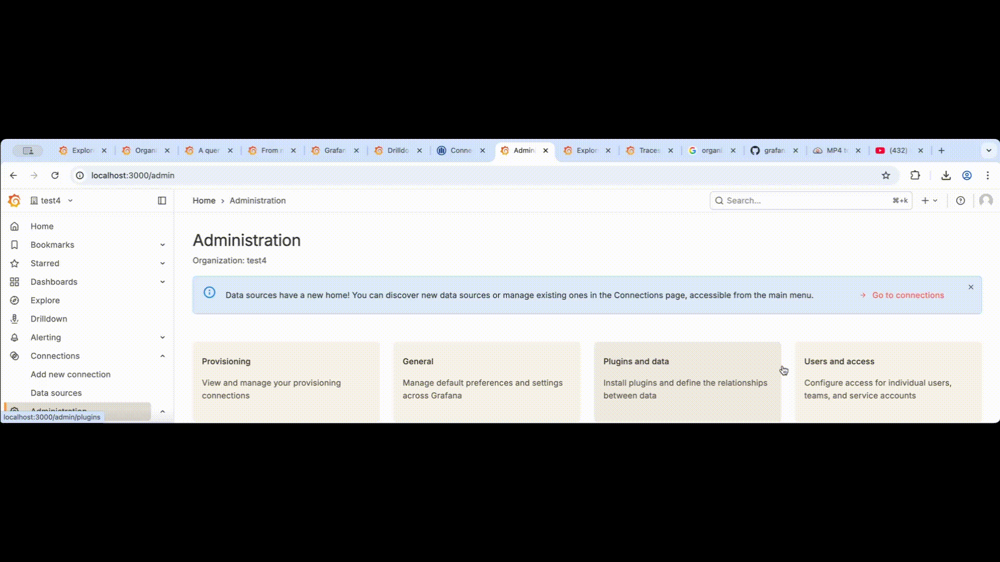

### Change your personal UI theme

* Profile > Preferences section > select the UI theme

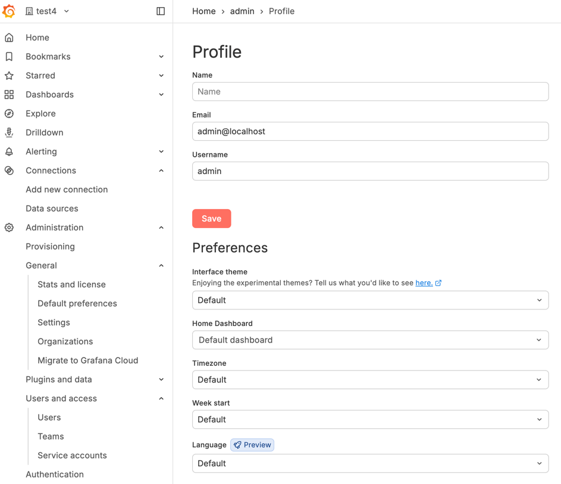

## Change the Grafana default timezone

* by default,
  * your web browser's timezone
* levels | override this setting
  * server,
  * organization,
  * team,
  * individual user

### Set server timezone

* | Grafana configuration file,
  * [default_timezone](../../setup-grafana/configure-grafana/_index.md#default_timezone) 

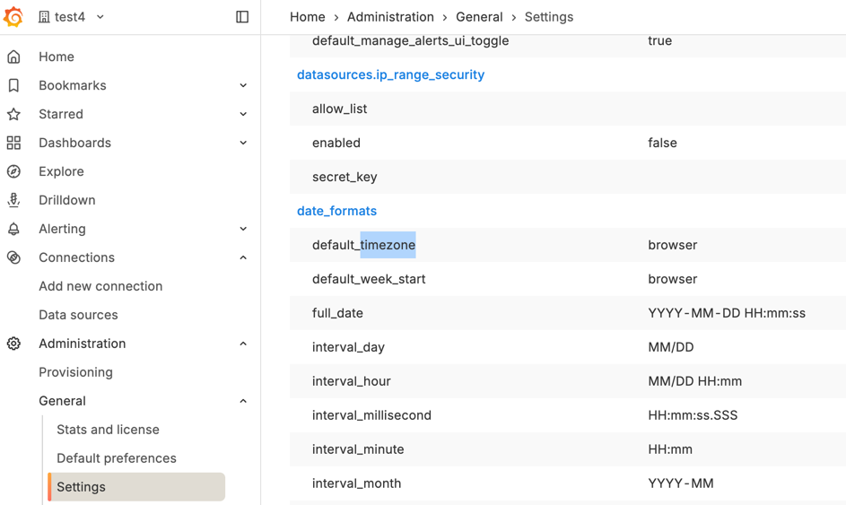

### Set organization timezone

* **Administration** > **General** > **Default preferences** > Timezone

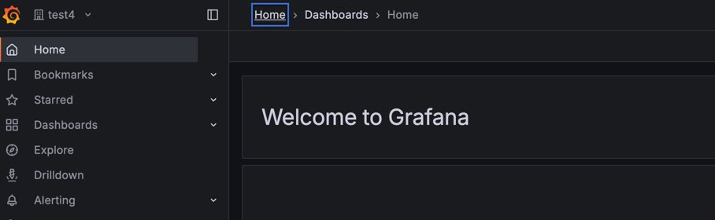

### Set team timezone

* affects ALL team's users 

* **Administration** > **Users and access** > **Teams** > choose 1 > **Settings** > Timezone

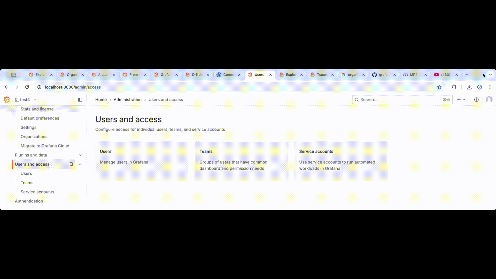

### Set your personal timezone

* overrides timezone settings
 
* **Profile** > **Preferences** > Timezone

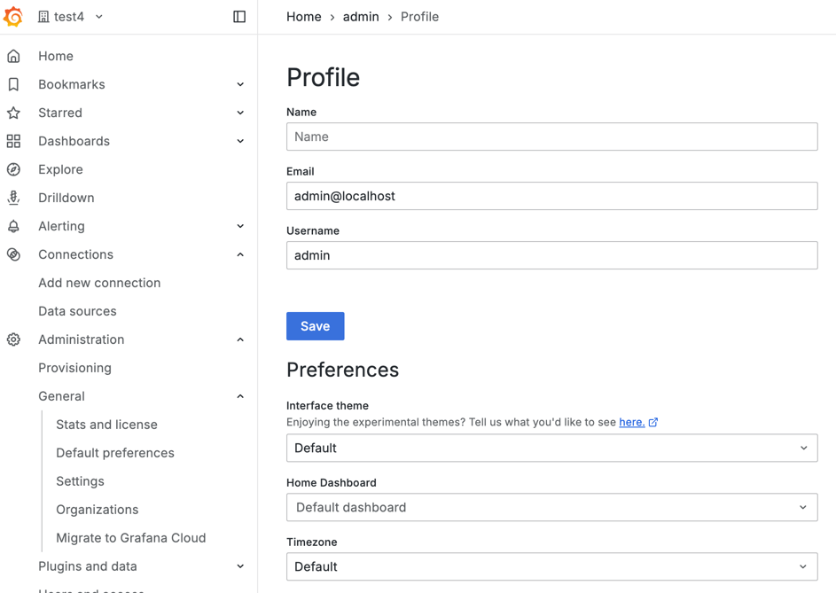

## Change the default home dashboard

* home dashboard
  * == Grafana UI default page
  * it can be set | 
    * server, 
    * organization, 
    * team, 
    * your personal user account 

* Grafana icon OR **Home**

### Set the home dashboard for the server

* goal
  * use a ".json" -- as -- home dashboard | ALL users | server 
* requirements
  * users / Grafana Server Admin flag OR access to the configuration file

#### Convert an existing dashboard -- into a -- ".json"

* Dashboards > choose 1 > Export as JSON

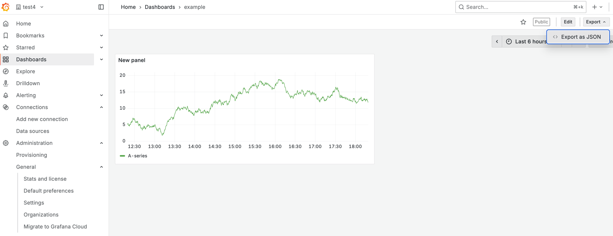

#### Use a ".json" -- as -- home dashboard

* [`default_home_dashboard_path`](../../setup-grafana/configure-grafana/#default_home_dashboard_path)

  ```ini
  [dashboards]
  # Path to the default home dashboard. If this value is empty, then Grafana uses StaticRootPath + "dashboards/home.json"
  default_home_dashboard_path = data/someDashboardFile.json
  ```

### Set the home dashboard for your organization

* **Administration** > **General** > **Default preferences** > Home Dashboard

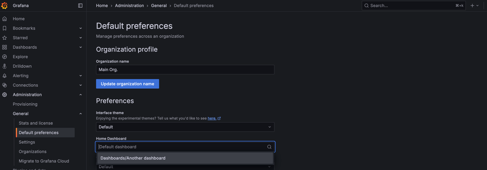

### Set home dashboard for your team

* **Administration** > **Users and access** > **Teams** > choose 1 > **Settings** > Home Dashboard

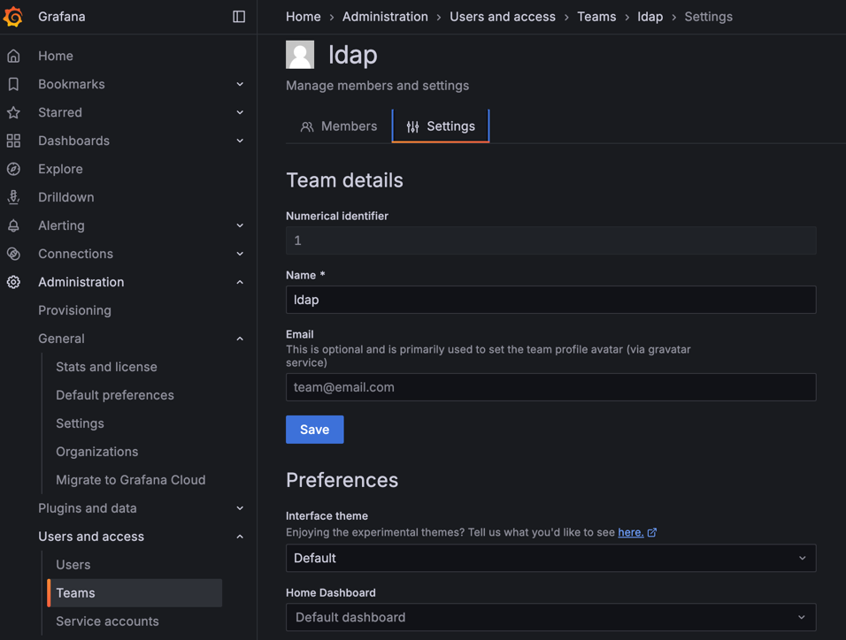

### Set your personal home dashboard

You can choose your own personal home dashboard. This setting overrides all home dashboards set at higher levels.

1. Navigate to the dashboard you want to set as the home dashboard.
1. Click the star next to the dashboard title to mark the dashboard as a favorite if it is not already.
1. Click the user icon in the top right corner of the page and select **Profile**.
1. In the **Home Dashboard** field, select the dashboard that you want to use for your home dashboard. Options include all starred dashboards.
1. Click **Save**.

## Change Grafana language

### Change server language

Grafana server administrators can change the default Grafana UI language for all users on the server by setting the [default_language](../../setup-grafana/configure-grafana/#default_language) option in the Grafana configuration file.

### Change organization language

Organization administrators can change the language for all users in an organization.

1. Click **Administration** in the left-side menu.
1. Click **General**.
1. Click **Default preferences**.
1. In the Preferences section, select an option in the **Language** dropdown.
1. Click **Save**.

### Change team language

Organization and team administrators can set a default language for all users on a team.

1. Click **Administration** in the left-side menu, **Users and access**, and select **Teams**.
1. Click the team for which you want to change the language.
1. Click the **Settings** tab.
1. In the Preferences section, select an option in the **Language** dropdown.
1. Click **Save**.

### Change your personal language

You can change the language for your user account. This setting overrides language settings at higher levels.

1. Click the user icon in the top right corner of the page and select **Profile**.
1. In the Preferences section, select an option in the **Language** dropdown.
1. Click **Save**.
