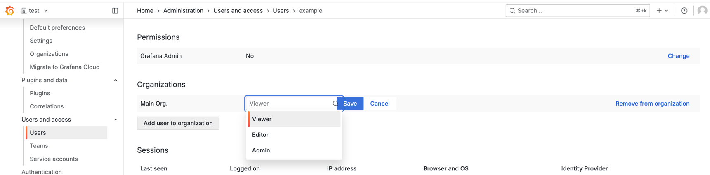

---
aliases:
  - ../manage-users/
  - ../permissions/
  - ../permissions/organization_roles/
  - ../permissions/overview/
  - manage-users-and-permissions/about-users-and-permissions/
description: Information about Grafana user, team, and organization roles and permissions
labels:
  products:
    - enterprise
    - oss
    - cloud
title: Roles and permissions
weight: 300
---

# Roles and permissions

* _user_
  * == individual / can log in | Grafana
    * has an associated _role_ / includes _permissions_

* Permissions
  * determine
    * tasks / user can perform | system
  * types
    - [Grafana server administrator permissions](#grafana-server-administrators)
      - manage Grafana
        - server-wide settings
        - resources
    - [Organization permissions](#organization-users-and-permissions)
      - manage access to organization resources (dashboards, alerts, plugins, teams, playlists, ...) 
      - AVAILABLE roles
        - Viewer,
        - Editor,
        - Admin
    - [Dashboard & folder permission](#dashboard-permissions)
      - manage access to dashboards & folders

* | Grafana Enterprise,
  * ADDITIONAL features
    * [RBAC](access-control) 
    * [data sources permissions](../data-source-management/#data-source-permissions/)
      * == restrict data source query permissions

* | Grafana Cloud,
  * if you want to make org role changes -> contact to your org administrator
    * ❌Grafana Support is NOT authorized❌  

## Grafana server administrators

* Grafana server administrator
  * responsible for
    * server-wide settings ([Configuration](../../setup-grafana/configure-grafana/))
    * manage access to resources (organizations, users, and licenses)
    * check Grafana server statistics
    * upgrade to Grafana Enterprise
  * 👀built-in default server administrator👀
    * allows
      * manage ALL Grafana
    * uses
      * divide default server administrator's responsibility AMONG OTHER server administrators / you create
  * server administrator role
    * ⚠️!= Grafana [organization administrator](#organization-roles)⚠️
    * | Grafana cloud,
      * ❌NOT exist❌

## Organization users and permissions

* ALL Grafana users
  * ⚠️belong to >= 1 organization⚠️

* organization
  * == entity / exists | your Grafana instance
  * 's resources
    - dashboards and folders
    - alerts
    - playlists
    - users within that organization
    - data sources
    - teams
    - organization and team settings
    - plugins
    - annotations
    - library panels
    - service accounts
  * [users](../user-management/manage-org-users/)

### Organization roles

* 👀roles / control user access👀
  - **Organization administrator**
    - access to ALL organization resources (dashboards, users, teams, ...)
  - **Editor**
    - view & edit dashboards, folders, and playlists
  - **Viewer**
    - view dashboards, playlists
    - query data sources
  - **No Basic Role**
    - NO permissions

  

* Organization role-based permissions
  * global
    * == EACH permission level applies -- to -- ALL organization's Grafana resources
  * are

| Permission                     | Organization administrator | Editor | Viewer | No Basic Role |
| :----------------------------- | :------------------------: | :----: | :----: | :-----------: |
| View dashboards                |            yes             |  yes   |  yes   |               |
| Add, edit, delete dashboards   |            yes             |  yes   |        |               |
| Add, edit, delete folders      |            yes             |  yes   |        |               |
| View playlists                 |            yes             |  yes   |  yes   |               |
| Add, edit, delete playlists    |            yes             |  yes   |        |               |
| Create library panels          |            yes             |  yes   |        |               |
| View annotations               |            yes             |  yes   |  yes   |               |
| Add, edit, delete annotations  |            yes             |  yes   |        |               |
| Access Explore                 |            yes             |  yes   |        |               |
| Query data sources directly    |            yes             |  yes   |  yes   |               |
| Add, edit, delete data sources |            yes             |        |        |               |
| Add and edit users             |            yes             |        |        |               |
| Add and edit teams             |            yes             |        |        |               |
| Change organizations settings  |            yes             |        |        |               |
| Change team settings           |            yes             |        |        |               |
| Configure application plugins  |            yes             |        |        |               |

## Dashboard permissions

* override the organization permissions 
* uses
  * extend a viewer's ability
    * _Example:_ see ALL dashboards BUT can update 1! dashboard
  * limit an editor's permission / modify a dashboard

* AVAILABLE dashboard permissions
  * **Admin**
    - | dashboard,
      - create, edit, or delete 
    - | folder & subfolders,
      - edit or delete
    - | dashboard & folder permissions,
      - change 
    - | dashboard & folder
      - if a user creates a dashboard OR folder -> AUTOMATICALLY granted **Admin** permissions for it 
  * **Edit**
    - | dashboard,
      - create, edit, or delete
    - | folder & subfolders,
      - edit or delete
  * **View**
    - | dashboard & folder,
      - view

* [MORE](../user-management/manage-dashboard-permissions/#grant-dashboard-folder-permissions)

## Teams and permissions

* team
  * == organization's group of users / COMMON dashboard needs & data source permission needs
  * allows
    * avoid creating MULTIPLE users / assign INDIVIDUAL permissions
  * member's permissions
    * **Member**
      * user == team's member 
      * ❌NOT have team administrator privileges❌
    * **Admin**
      * 's permission
        * can manage team's membership, permissions, and settings 

* user
  * can belong to >=1 teams

* [MORE](../team-management/)
