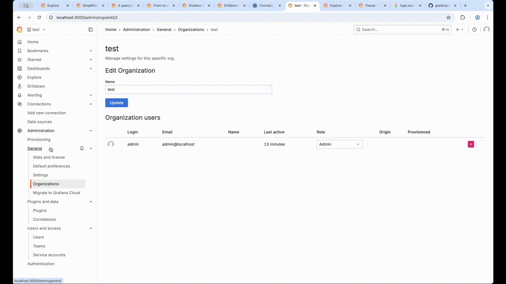

# requirements
* `docker run -d -p 3000:3000 grafana/grafana`

# Grafana server administrators
## responsible for
### server-wide settings
* http://localhost:3000/admin/settings
### manage access to resources
* http://localhost:3000/admin/orgs
### check Grafana server statistics
* http://localhost:3000/admin/upgrading
### upgrade to Grafana Enterprise
* http://localhost:3000/admin/migrate-to-cloud

## built-in default server administrator
* http://localhost:3000/profile

# Organization users and permissions
## ALL Grafana users belong -- to -- >=1 organization
* create
  * another organization
  * user | another organization
* check
  * admin exists | BOTH organizations
  * another user exists | another oganization

