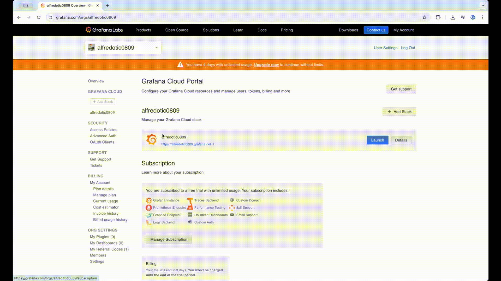

---
aliases:
  - manage-users-and-permissions/
labels:
  products:
    - enterprise
    - oss
title: User management
weight: 200
---

# User management

* goal
  * how to control user access -- , via use permissions, to -- data sources, dashboards, users, and teams 

* _user_
  * == individual / can log in | Grafana
  * associated -- with a -- _role_ / includes _permissions_

* Permissions
  * determine
    * the tasks / user can perform | system

* [Youtube](https://www.youtube.com/watch?v=59uCGJN5hPI)
  * | Grafana Cloud Portal
    
  * | self-managed Grafana
    * == | Grafana UI
    
    
