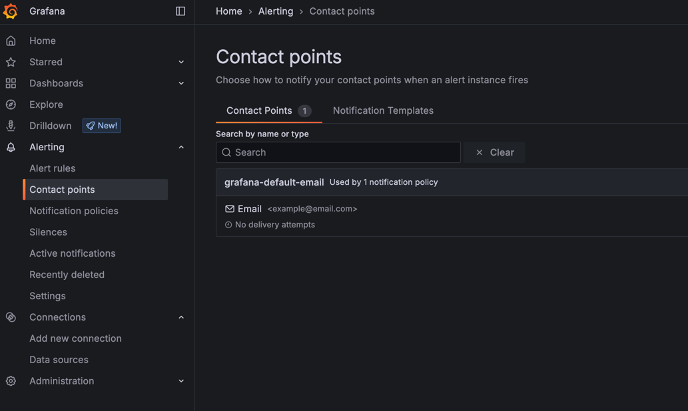

---
aliases:
  - ../contact-points/create-contact-point/ # /docs/grafana/<GRAFANA_VERSION>/alerting/contact-points/create-contact-point/
  - ../contact-points/delete-contact-point/ # /docs/grafana/<GRAFANA_VERSION>/alerting/contact-points/delete-contact-point/
  - ../contact-points/edit-contact-point/ # /docs/grafana/<GRAFANA_VERSION>/alerting/contact-points/edit-contact-point/
  - ../contact-points/test-contact-point/ # /docs/grafana/<GRAFANA_VERSION>/alerting/contact-points/test-contact-point/
  - ../manage-notifications/manage-contact-points/ # /docs/grafana/<GRAFANA_VERSION>/alerting/manage-notifications/manage-contact-points/
  - ../alerting-rules/create-contact-point/ # /docs/grafana/<GRAFANA_VERSION>/alerting/alerting-rules/create-contact-point/
  - ../alerting-rules/manage-contact-points/ # /docs/grafana/<GRAFANA_VERSION>/alerting/alerting-rules/manage-contact-points/
  - ../alerting-rules/create-notification-policy/ # /docs/grafana/<GRAFANA_VERSION>/alerting/alerting-rules/create-notification-policy/
  - ../alerting-rules/manage-contact-points/integrations/ # /docs/grafana/<GRAFANA_VERSION>/alerting/alerting-rules/manage-contact-points/integrations/
  - ../manage-notifications/manage-contact-points/ # /docs/grafana/<GRAFANA_VERSION>/alerting/manage-notifications/manage-contact-points/
canonical: https://grafana.com/docs/grafana/latest/alerting/configure-notifications/manage-contact-points/
description: Configure contact points to define how your contacts are notified when an alert rule fires
keywords:
  - grafana
  - alerting
  - guide
  - contact point
  - templating
labels:
  products:
    - cloud
    - enterprise
    - oss
title: Configure contact points
weight: 410
refs:
  alertmanager:
    - pattern: /docs/grafana/
      destination: /docs/grafana/<GRAFANA_VERSION>/alerting/configure-notifications/manage-contact-points/integrations/configure-alertmanager/
    - pattern: /docs/grafana-cloud/
      destination: /docs/grafana-cloud/alerting-and-irm/alerting/configure-notifications/manage-contact-points/integrations/configure-alertmanager/
  sns:
    - pattern: /docs/grafana/
      destination: /docs/grafana/<GRAFANA_VERSION>/alerting/configure-notifications/manage-contact-points/integrations/configure-amazon-sns/
    - pattern: /docs/grafana-cloud/
      destination: /docs/grafana-cloud/alerting-and-irm/alerting/configure-notifications/manage-contact-points/integrations/configure-amazon-sns/
  gchat:
    - pattern: /docs/grafana/
      destination: /docs/grafana/<GRAFANA_VERSION>/alerting/configure-notifications/manage-contact-points/integrations/configure-google-chat/
    - pattern: /docs/grafana-cloud/
      destination: /docs/grafana-cloud/alerting-and-irm/alerting/configure-notifications/manage-contact-points/integrations/configure-google-chat/
  email:
    - pattern: /docs/grafana/
      destination: /docs/grafana/<GRAFANA_VERSION>/alerting/configure-notifications/manage-contact-points/integrations/configure-email/
    - pattern: /docs/grafana-cloud/
      destination: /docs/grafana-cloud/alerting-and-irm/alerting/configure-notifications/manage-contact-points/integrations/configure-email/
  discord:
    - pattern: /docs/grafana/
      destination: /docs/grafana/<GRAFANA_VERSION>/alerting/configure-notifications/manage-contact-points/integrations/configure-discord/
    - pattern: /docs/grafana-cloud/
      destination: /docs/grafana-cloud/alerting-and-irm/alerting/configure-notifications/manage-contact-points/integrations/configure-discord/
  telegram:
    - pattern: /docs/grafana/
      destination: /docs/grafana/<GRAFANA_VERSION>/alerting/configure-notifications/manage-contact-points/integrations/configure-telegram/
    - pattern: /docs/grafana-cloud/
      destination: /docs/grafana-cloud/alerting-and-irm/alerting/configure-notifications/manage-contact-points/integrations/configure-telegram/
  webhook:
    - pattern: /docs/grafana/
      destination: /docs/grafana/<GRAFANA_VERSION>/alerting/configure-notifications/manage-contact-points/integrations/webhook-notifier/
    - pattern: /docs/grafana-cloud/
      destination: /docs/grafana-cloud/alerting-and-irm/alerting/configure-notifications/manage-contact-points/integrations/webhook-notifier/
  opsgenie:
    - pattern: /docs/grafana/
      destination: /docs/grafana/<GRAFANA_VERSION>/alerting/configure-notifications/manage-contact-points/integrations/configure-opsgenie/
    - pattern: /docs/grafana-cloud/
      destination: /docs/grafana-cloud/alerting-and-irm/alerting/configure-notifications/manage-contact-points/integrations/configure-opsgenie/
  pagerduty:
    - pattern: /docs/grafana/
      destination: /docs/grafana/<GRAFANA_VERSION>/alerting/configure-notifications/manage-contact-points/integrations/pager-duty/
    - pattern: /docs/grafana-cloud/
      destination: /docs/grafana-cloud/alerting-and-irm/alerting/configure-notifications/manage-contact-points/integrations/pager-duty/
  irm:
    - pattern: /docs/grafana/
      destination: /docs/grafana/<GRAFANA_VERSION>/alerting/configure-notifications/manage-contact-points/integrations/configure-irm/
    - pattern: /docs/grafana-cloud/
      destination: /docs/grafana-cloud/alerting-and-irm/alerting/configure-notifications/manage-contact-points/integrations/configure-irm/
  slack:
    - pattern: /docs/grafana/
      destination: /docs/grafana/<GRAFANA_VERSION>/alerting/configure-notifications/manage-contact-points/integrations/configure-slack/
    - pattern: /docs/grafana-cloud/
      destination: /docs/grafana-cloud/alerting-and-irm/alerting/configure-notifications/manage-contact-points/integrations/configure-slack/
  teams:
    - pattern: /docs/grafana/
      destination: /docs/grafana/<GRAFANA_VERSION>/alerting/configure-notifications/manage-contact-points/integrations/configure-teams/
    - pattern: /docs/grafana-cloud/
      destination: /docs/grafana-cloud/alerting-and-irm/alerting/configure-notifications/manage-contact-points/integrations/configure-teams/
  mqtt:
    - pattern: /docs/grafana/
      destination: /docs/grafana/<GRAFANA_VERSION>/alerting/configure-notifications/manage-contact-points/integrations/configure-mqtt/
    - pattern: /docs/grafana-cloud/
      destination: /docs/grafana-cloud/alerting-and-irm/alerting/configure-notifications/manage-contact-points/integrations/configure-mqtt/
  configure-alertmanager:
    - pattern: /docs/grafana/
      destination: /docs/grafana/<GRAFANA_VERSION>/alerting/set-up/configure-alertmanager/
    - pattern: /docs/grafana-cloud/
      destination: /docs/grafana-cloud/alerting-and-irm/alerting/set-up/configure-alertmanager/
  manage-notification-templates:
    - pattern: /docs/grafana/
      destination: /docs/grafana/<GRAFANA_VERSION>/alerting/configure-notifications/template-notifications/manage-notification-templates/
    - pattern: /docs/grafana-cloud/
      destination: /docs/grafana-cloud/alerting-and-irm/alerting/configure-notifications/template-notifications/manage-notification-templates/
  jira:
    - pattern: /docs/grafana/
      destination: /docs/grafana/<GRAFANA_VERSION>/alerting/configure-notifications/manage-contact-points/integrations/configure-jira/
    - pattern: /docs/grafana-cloud/
      destination: /docs/grafana-cloud/alerting-and-irm/alerting/configure-notifications/manage-contact-points/integrations/configure-jira/
  configure-grafana-alerts:
    - pattern: /docs/grafana/
      destination: /docs/grafana/<GRAFANA_VERSION>/alerting/alerting-rules/create-grafana-managed-rule/
    - pattern: /docs/grafana-cloud/
      destination: /docs/grafana-cloud/alerting-and-irm/alerting/alerting-rules/create-grafana-managed-rule/
  configure-contact-points:
    - pattern: /docs/grafana/
      destination: /docs/grafana/<GRAFANA_VERSION>/alerting/configure-notifications/manage-contact-points/
    - pattern: /docs/grafana-cloud/
      destination: /docs/grafana-cloud/alerting-and-irm/alerting/configure-notifications/manage-contact-points/
---

# Configure contact points

* | Grafana UI,
  * Alerting, Contact Points tab

* allows
  * about contact points & integrations,
    * add,
    * edit,
    * view
    * search
    * export
    * delete
      * ❌if SOME is being used -> can NOT be deleted❌
        * Solution: 🧠update / use ANOTHER contact point🧠
  * about notification deliveries,
    * view 's status
  * view notification policies / use SAME contact point

* Contact points
  * ⚠️are assigned -- to -- [1! specific Alertmanager](ref:configure-alertmanager)⚠️
    * ❌can NOT be used -- by -- notification policies | OTHER Alertmanagers❌

## Supported contact point integrations

* / EACH contact point integration, OWN
  * configuration options
  * setup process

* contact point integrations / 
  * supported -- by -- Grafana
    - [Alertmanager](ref:alertmanager)
    - [AWS SNS](ref:sns)
    - Cisco Webex Teams
    - DingDing
    - [Discord](ref:discord)
    - [Email](ref:email)
    - [Google Chat](ref:gchat)
    - [Grafana IRM](ref:irm)
    - Kafka REST Proxy
    - [Jira](ref:jira)
    - Line
    - [Microsoft Teams](ref:teams)
    - [MQTT](ref:mqtt)
    - [Opsgenie](ref:opsgenie)
    - [PagerDuty](ref:pagerduty)
    - Pushover
    - Sensu Go
    - [Slack](ref:slack)
    - [Telegram](ref:telegram)
    - Threema Gateway
    - VictorOps
    - [Webhook](ref:webhook)
    - WeCom
  * supported -- by -- Prometheus Alertmanager
    * [here](https://prometheus.io/docs/alerting/latest/configuration/#receiver-integration-settings)

## Add a contact point

Complete the following steps to add a contact point.

1. In the left-side menu, click **Alerts & IRM** and then **Alerting**.
1. Click **Contact points**.
1. From the **Choose Alertmanager** dropdown, select an Alertmanager. By default, **Grafana Alertmanager** is selected.
1. On the **Contact Points** tab, click **+ Add contact point**.
1. Enter a descriptive name for the contact point.
1. From **Integration**, select a type and fill out mandatory fields. For example, if you choose email, enter the email addresses. Or if you choose Slack, enter the Slack channel and users who should be contacted.
1. Some [contact point integrations](#supported-contact-point-integrations), like email or Webhook, have optional settings. In **Optional settings**, specify additional settings for the selected contact point integration.
1. In Notification settings, optionally select **Disable resolved message** if you do not want to be notified when an alert resolves.
1. Save your changes.

## Add another contact point integration

A contact point can have multiple integrations, or destinations for sending notifications.

To add another integration to a contact point, complete the following steps.

1. Add or edit an existing contact point.
1. Click **Add contact point integration** and repeat the same steps as [Add a contact point](#add-a-contact-point).
   - From **Integration**, select a type and fill out mandatory fields.
   - In **Optional settings**, specify additional settings for the selected contact point integration.
1. Save your changes.

## Customize notification messages

In contact points, you can also customize notification messages. For example, when setting up an email contact point integration, click **Message** or **Subject** to modify it.

By default, notification messages include common alert details, which are usually sufficient for most cases.

If necessary, you can customize the content and format of notification messages. You can create a custom notification template, which can then be applied to one or more contact points.

On the **Notification templates** tab, you can view, edit, copy or delete notification templates. Refer to [manage notification templates](ref:manage-notification-templates) for instructions on selecting or creating a template for a contact point.

## Test a contact point

Testing a contact point is only available for Grafana Alertmanager. Complete the following steps to test a contact point.

1. In the left-side menu, click **Alerts & IRM** and then **Alerting**.
1. Click **Contact points** to view a list of existing contact points.
1. On the **Contact Points** tab, find the contact point you want to test, then click **Edit**. You can also create a new contact point if needed.
1. Click **Test** to open the contact point testing dialog box.
1. Choose whether to send a predefined test notification or choose custom to add your own custom annotations and labels to include in the notification.
1. Click **Send test notification** to fire the alert.

## Enable notifications for a contact point

After creating a contact point, you can enable it to receive alert notifications using one of the following methods:

- **Assign it to alert rules** – Select the contact point in the [notifications options for Grafana-managed alert rules](ref:configure-grafana-alerts) to directly associate it with specific alerts.
- **Assign it to notification policies** – Add the contact point to one or more [notification policies](ref:configure-contact-points), which manage the alert notifications you want the contact point to receive.
