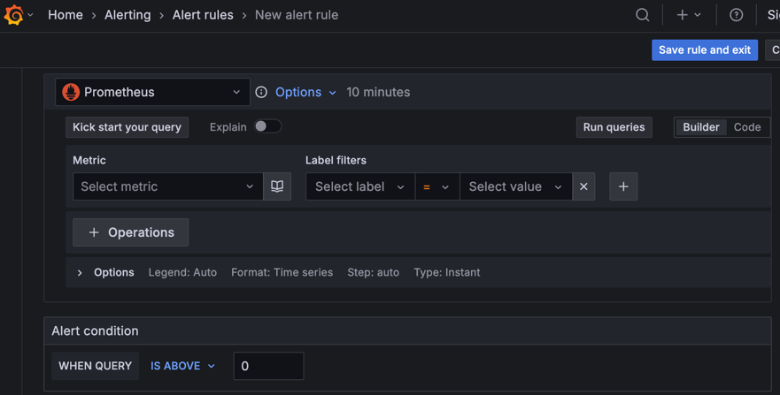

---
aliases:
  - ./metrics/ # /docs/grafana/<GRAFANA_VERSION>/alerting/metrics/
  - ./unified-alerting/fundamentals/ # /docs/grafana/<GRAFANA_VERSION>/alerting/unified-alerting/fundamentals/
canonical: https://grafana.com/docs/grafana/latest/alerting/fundamentals/
description: Learn about the fundamentals of Grafana Alerting as well as the key features it offers
labels:
  products:
    - cloud
    - enterprise
    - oss
menuTitle: Introduction
title: Introduction to Grafana Alerting
weight: 100
refs:
  notifications:
    - pattern: /docs/grafana/
      destination: /docs/grafana/<GRAFANA_VERSION>/alerting/fundamentals/notifications/
    - pattern: /docs/grafana-cloud/
      destination: /docs/grafana-cloud/alerting-and-irm/alerting/fundamentals/notifications/
  notification-policies:
    - pattern: /docs/grafana/
      destination: /docs/grafana/<GRAFANA_VERSION>/alerting/fundamentals/notifications/notification-policies/
    - pattern: /docs/grafana-cloud/
      destination: /docs/grafana-cloud/alerting-and-irm/alerting/fundamentals/notifications/notification-policies/
  silences:
    - pattern: /docs/grafana/
      destination: /docs/grafana/<GRAFANA_VERSION>/alerting/configure-notifications/create-silence/
    - pattern: /docs/grafana-cloud/
      destination: /docs/grafana-cloud/alerting-and-irm/alerting/configure-notifications/create-silence/
  alert-rules:
    - pattern: /docs/grafana/
      destination: /docs/grafana/<GRAFANA_VERSION>/alerting/fundamentals/alert-rules/
    - pattern: /docs/grafana-cloud/
      destination: /docs/grafana-cloud/alerting-and-irm/alerting/fundamentals/alert-rules/
  contact-points:
    - pattern: /docs/grafana/
      destination: /docs/grafana/<GRAFANA_VERSION>/alerting/fundamentals/notifications/contact-points/
    - pattern: /docs/grafana-cloud/
      destination: /docs/grafana-cloud/alerting-and-irm/alerting/fundamentals/notifications/contact-points/
  mute-timings:
    - pattern: /docs/grafana/
      destination: /docs/grafana/<GRAFANA_VERSION>/alerting/configure-notifications/mute-timings/
    - pattern: /docs/grafana-cloud/
      destination: /docs/grafana-cloud/alerting-and-irm/alerting/configure-notifications/mute-timings/
  external-alertmanagers:
    - pattern: /docs/grafana/
      destination: /docs/grafana/<GRAFANA_VERSION>/alerting/set-up/configure-alertmanager/
    - pattern: /docs/grafana-cloud/
      destination: /docs/grafana-cloud/alerting-and-irm/alerting/set-up/configure-alertmanager/
  alert-rule-evaluation:
    - pattern: /docs/grafana/
      destination: /docs/grafana/<GRAFANA_VERSION>/alerting/fundamentals/alert-rules/rule-evaluation/
    - pattern: /docs/grafana-cloud/
      destination: /docs/grafana-cloud/alerting-and-irm/alerting/fundamentals/alert-rules/rule-evaluation/
  group-alert-notifications:
    - pattern: /docs/grafana/
      destination: /docs/grafana/<GRAFANA_VERSION>/alerting/fundamentals/notifications/group-alert-notifications/
    - pattern: /docs/grafana-cloud/
      destination: /docs/grafana-cloud/alerting-and-irm/alerting/fundamentals/notifications/group-alert-notifications/
  multi-dimensional-alerts-example:
    - pattern: /docs/grafana/
      destination: /docs/grafana/<GRAFANA_VERSION>/alerting/best-practices/multi-dimensional-alerts/
    - pattern: /docs/grafana-cloud/
      destination: /docs/grafana-cloud/alerting-and-irm/alerting/best-practices/multi-dimensional-alerts/
  tutorials:
    - pattern: /docs/grafana/
      destination: /docs/grafana/<GRAFANA_VERSION>/alerting/best-practices/tutorials/
    - pattern: /docs/grafana-cloud/
      destination: /docs/grafana-cloud/alerting-and-irm/alerting/best-practices/tutorials/
---

# Introduction to Grafana Alerting

* Grafana Alerting
  * lets you
    * define alert rules | MULTIPLE data sources
    * manage notifications / flexible routing
  * 💡built | Prometheus alerting model💡
  * integrates -- with the -- Grafana stack

* [tutorials](ref:tutorials)

## Fundamentals

### Alert rules

* [alert rule](ref:alert-rules)
  * 💡\>= 1 queries & expressions / filter in data you want to measure + threshold condition💡
  * steps | configure
    * choose the contact point OR notification policies
      * Reason:🧠 how to receive the alert notifications🧠

### Alert rule evaluation

* [Alert rules evalutation](ref:alert-rule-evaluation)
  * 👀are FREQUENTLY evaluated👀
    * Reason:🧠alert instance's status == data sources are real-time changing🧠

### Alert instances OR Alerts

* alert instances == alerts

* EACH alert rule can produce >= 1 alert instances
  * 👀1 alert instance / EACH time series OR dimension👀
  * allows
    * 👀observe >=1 resources | 1! expression👀

### Contact points

* [Contact points](ref:contact-points) 
  * == notification message & where notifications are sent

* _Example:_ have a contact point that sends notifications to an email address
to Slack, to an incident management system (IRM) such as Grafana IRM or PagerDuty, or to a webhook.

### Notification messages

* By default, notification messages include alert details, such as the number of alerts, 
their status, and annotations to help responders address alert issues
* Notification messages can also be customized.

In the alert rule, you can choose a contact point to receive the alert notifications or use notification policies instead.

### Notification policies

[Notification policies](ref:notification-policies) are an advanced option for handling alert notifications by distinct scopes
such as by team or service—ideal for managing large alerting systems.

Notification policies routes alerts to contact points via label matching
* They are defined in a tree structure, where the root of the notification policy tree is the **Default notification policy**, which ensures all alert instances are handled.

 

Each notification policy decides where to send the alert (contact point) and when to send the notification (timing options).

### Notification grouping

To reduce alert noise, Grafana Alerting [groups related firing alerts into a single notification](ref:group-alert-notifications) by default
* You can customize this behavior in the alert rule or notification policy settings.

### Silences and mute timings

[Silences](ref:silences) and [mute timings](ref:mute-timings) allow you to pause notifications without interrupting alert rule evaluation
* Use a silence to pause notifications on a one-time basis, such as during a maintenance window; and use mute timings to pause notifications at regular intervals, such as evenings and weekends.
