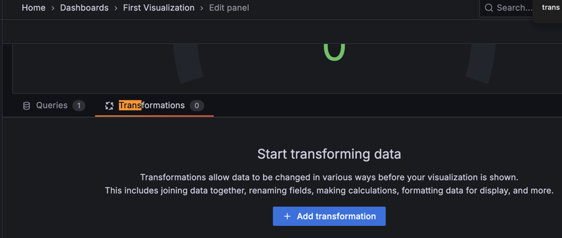

---
aliases:
  - features/dashboard/dashboards/ # /docs/grafana/latest/features/dashboard/dashboards/
  - ./dashboards/previews/ # /docs/grafana/latest/dashboards/previews/
labels:
  products:
    - cloud
    - enterprise
    - oss
title: Dashboards
weight: 70
description: Create and manage dashboards
hero:
  title: Dashboards
  level: 1
  width: 110
  height: 110
  description: >-
    Dashboards allow you to query, transform, visualize, and understand your data no matter where it's stored.
cards:
  title_class: pt-0 lh-1
  items:
    - title: Build dashboards
      href: ./build-dashboards/
      description: Get step-by-step directions for how to create or import your first dashboard and modify dashboard settings. Learn about reusable library panels, dashboard links, annotations, and dashboard JSON.
      height: 24
    - title: Manage dashboards
      href: ./manage-dashboards/
      description: Learn about dashboard and folder management, as well as generative AI features for dashboards.
      height: 24
    - title: Variables
      href: ./variables/
      description: Add variables to metric queries and panel titles to create interactive and dynamic dashboards.
      height: 24
    - title: Reporting
      href: ./create-reports/
      description: Automatically generate and share PDF reports from your Grafana dashboards.
      height: 24
    - title: Sharing
      href: ./share-dashboards-panels/
      description: Share Grafana dashboards and panels using links, snapshots, embeds, and exports.
      height: 24
    - title: Shared dashboards
      href: ./share-dashboards-panels/shared-dashboards/
      description: Share your dashboards with anyone without requiring access to your Grafana organization.
      height: 24
refs:
  panels:
    - pattern: /docs/grafana/
      destination: /docs/grafana/<GRAFANA_VERSION>/panels-visualizations/panel-overview/
    - pattern: /docs/grafana-cloud/
      destination: /docs/grafana-cloud/visualizations/panels-visualizations/panel-overview/
---



---

## Overview

* Grafana dashboard
  * == set of [panelS](ref:panels)
    * placed | rows
  * goal
    * place related information | at-glance view
  * provide
    * query editor
      * Reason: 🧠accommodate different query languages / data source🧠
  * uses
    * data source's data is 
      * queried
      * transformed | visualizations

* Data sources
  * _Examples:_ SQL databases, Grafana Loki, Grafana Mimir, API endpoints, CSV files
  * 's plugins
    * built-int +150
    * functionality by steps
      * Grafana's query is translated -- to -- native Data source's query
      * retrieve data from data source
      * return result / translated -- to -- Grafana's data model

* Queries
  * allow:
    * reduce data -- to -- specific dataset
      * == filter in data

* Panels
  * == 👀container / displays visualization👀
    * allows
      * manipulate visualization
  * 's options
    * customize visualization aspects
    * -- depend on -- visualization type
  * if data does NOT meet format's requirements -> apply [transformations](../panels-visualizations/query-transform-data/transform-data/)

    
