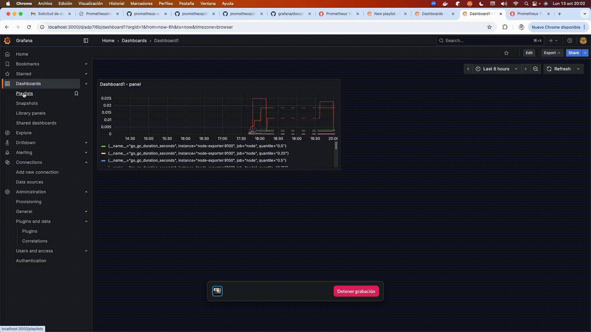

* `docker run -d --name=grafana -p 3000:3000 grafana/grafana:main`
* http://localhost:3000/
  * admin/admin

# == list of dashboards / displayed | sequence

# Create a playlist
* create dashboards
  * Dashboards > New > 
    * Add dashboard1
      * Add visualization > Data Source > Grafana
    * Add dashboard2
      * Add visualization > Data Source > Grafana > Transformations > Add field from calculation1 > Reduce row > First
    * Add dashboard3
      * Add visualization > Data Source > Grafana > Transformations > Add field from calculation1 > Reduce row > First
* create playlist
  * add several / even MULTIPLE times
  * adjust timing interval
* Playlists > Start playlist

