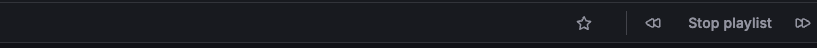

---
aliases:
  - ../reference/playlist/
  - playlist/
keywords:
  - grafana
  - dashboard
  - documentation
  - playlist
labels:
  products:
    - cloud
    - enterprise
    - oss
menuTitle: Manage playlists
title: Manage playlists
description: Create and manage dashboard playlists
weight: 500
---

# Manage playlists

* _playlist_
  * == 👀list of dashboards / displayed | sequence👀
  * uses
    * build situational awareness
    * present your metrics -- to -- your team or visitors

* requirements
  * if you want to create OR manage -> you need Editor role permissions

## Start a playlist

1. **Dashboards** > **Playlists** > **Start playlist** > 
   1. select 1 [playlist modes](#playlist-modes) 
   2. controls / you can disable
      - **Time and refresh**
      - **Variables**
      - **Dashboard links**
2. \> **Start \<playlist name\>**

### Playlist modes

* allows
  * specifying
    * how the menus & navigation bar appear | dashboards
    * how panels are sized

| Mode                          | Description                                                                                                                                                                                                                                                                                                                                          |
|-------------------------------|------------------------------------------------------------------------------------------------------------------------------------------------------------------------------------------------------------------------------------------------------------------------------------------------------------------------------------------------------|
| Normal mode                   | main menu & navbar remain visible   Dashboard controls are hidden   Playlist controls displayed \| top of the screen                                                                                                                                                                                                                         |
| Normal mode + auto fit panels | main menu & navbar remain visible   Dashboard controls are hidden   Playlist controls are displayed \| top of the screen   Dashboard panels AUTOMATICALLY adjust / optimize space \| screen                                                                                                                                              |
| Kiosk mode                    | main menu, navbar, and dashboard controls are hidden   if you want to interrupt the playlist -> press `Esc` & playlist controls are displayed \| top of the screen                                                                                                                                                                               |
| Kiosk mode + auto fit panels  | main menu, navbar, and dashboard controls are hidden   if you want to interrupt the playlist -> press `Esc` & playlist controls are displayed \| top of the screen   Dashboard panels AUTOMATICALLY adjust / optimize space \| screen |

### Playlist controls

- **Next (double-right arrow)**
  - NEXT dashboard
- **Back (doublt-left arrow)** 
  - PREVIOUS dashboard
- **Stop playlist** 
  - ends the playlist == exits to the CURRENT dashboard

## Create a playlist

* requirements
  * create ALL your required dashboards

1. **Dashboards** > **Playlists** > **New playlist** 
   1. add **Name**
   1. select **Interval** field
   1. **Add dashboards** section -- via -- **Add by title** OR **Add by tag**
1. **Save**
