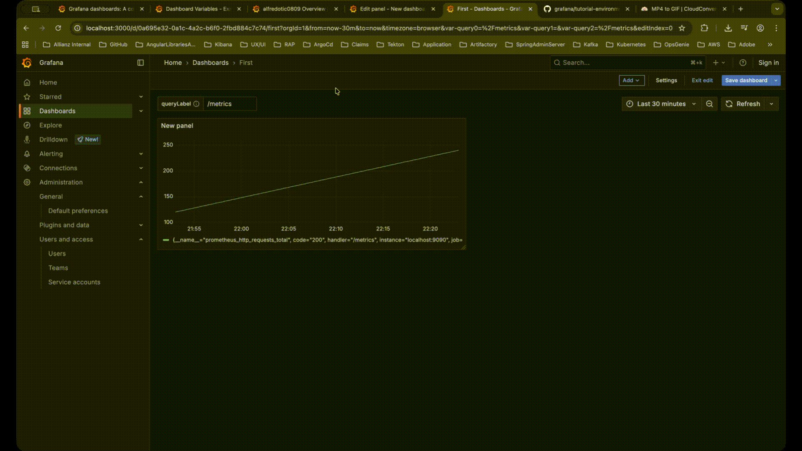
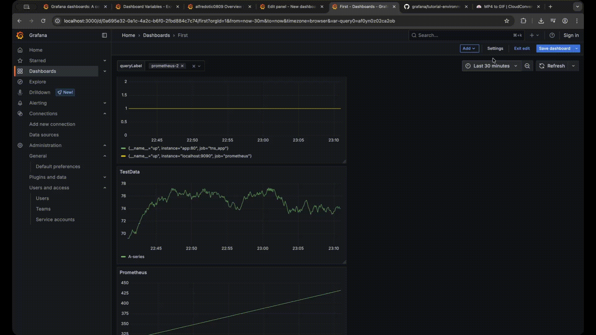
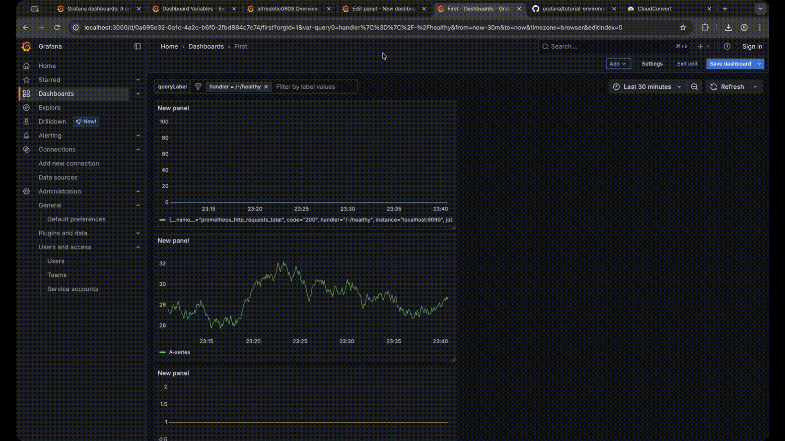

* [here](https://github.com/grafana/tutorial-environment)
* `docker compose up -d`
* http://localhost:3000/
  * admin/admin
  * Dashboard > New Dashboard > Add visualization > Datasource=prometheus > `prometheus_http_requests_total`

# Add a query variable
* steps
  * follow the steps
    * Query > 
      * Query type == Label values
      * Label = handler
      * Metrics = `prometheus_http_requests_total`
  * | Query
    * `prometheus_http_requests_total{handler="$query0"}`

# Add a custom variable
* steps
  * follow the steps
    * Custom options > `1, alfred, key1 : value1, /metrics`
  * | Query
    * `prometheus_http_requests_total{handler="$query0"}`

# Add a text box variable
* steps
  * follow the steps
  * | Query
    * `prometheus_http_requests_total{handler="$query0"}`

# Add a constant variable
* steps
  * follow the steps
  * | Query
    * `prometheus_http_requests_total{handler="$query0"}`

# Add a data source variable
* steps
  * Data sources > Add new data source > 
    * add MULTIPLE prometheus / 
      * DIFFERENT names
      * Connection: http://prometheus:9090
  * follow the steps

* _Example to see DIFFERENCE | switch BETWEEN data sources:_ [here](https://play.grafana.org/d/ddvzyhqvzw83kf/dashboard-variables?var-custominterval=1d&orgId=1&from=now-6h&to=now&timezone=utc&var-promsource=grafanacloud-prom&var-instance=$__all&var-cputype=idle&var-adhoc=&var-freetext=Hello,%20world%21)
  * switch "Prometheus source"

# Add an interval variable
* steps
  * follow the steps
  * | SOME panel / datasource == prometheus
    * `rate(prometheus_http_requests_total[${query0}])`

* _Example:_ [here](https://play.grafana.org/d/000000056/graphite-templated-nested?editPanel=2&orgId=1)

# Add ad hoc filters
* steps
  * follow the steps
    * Data source == Prometheus

