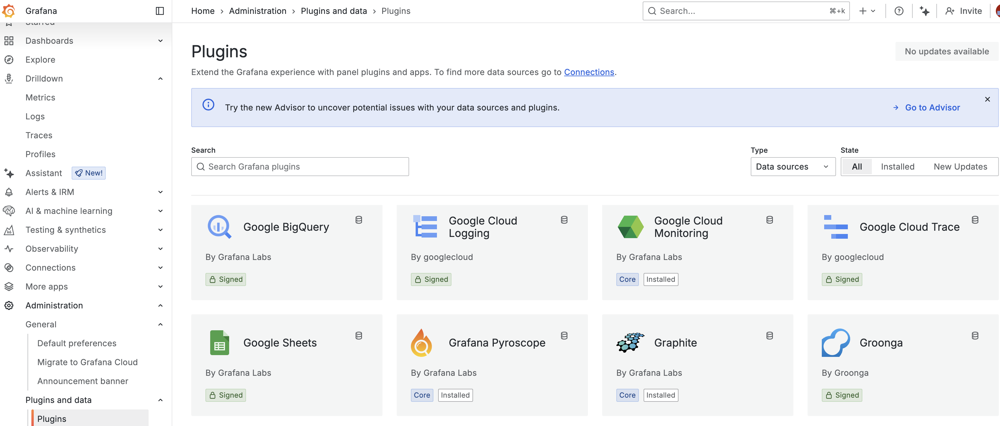
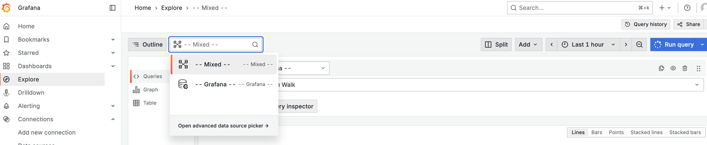

---
aliases:
  - data-sources/
  - overview/
  - ./features/datasources/
labels:
  products:
    - cloud
    - enterprise
    - oss
title: Data sources
weight: 60
refs:
  query-transform-data:
    - pattern: /docs/grafana/
      destination: /docs/grafana/<GRAFANA_VERSION>/panels-visualizations/query-transform-data/
    - pattern: /docs/grafana-cloud/
      destination: /docs/grafana/<GRAFANA_VERSION>/panels-visualizations/query-transform-data/
  alerts:
    - pattern: /docs/grafana/
      destination: /docs/grafana/<GRAFANA_VERSION>/alerting/
    - pattern: /docs/grafana-cloud/
      destination: /docs/grafana/<GRAFANA_VERSION>/alerting/
  grafana-enterprise:
    - pattern: /docs/grafana/
      destination: /docs/grafana/<GRAFANA_VERSION>/introduction/grafana-enterprise/
    - pattern: /docs/grafana-cloud/
      destination: /docs/grafana/<GRAFANA_VERSION>/introduction/grafana-enterprise/
  organization-roles:
    - pattern: /docs/grafana/
      destination: /docs/grafana/<GRAFANA_VERSION>/administration/roles-and-permissions/#organization-roles
    - pattern: /docs/grafana-cloud/
      destination: /docs/grafana/<GRAFANA_VERSION>/administration/roles-and-permissions/#organization-roles
  explore:
    - pattern: /docs/grafana/
      destination: /docs/grafana/<GRAFANA_VERSION>/explore/
    - pattern: /docs/grafana-cloud/
      destination: /docs/grafana/<GRAFANA_VERSION>/explore/
  data-source-management:
    - pattern: /docs/grafana/
      destination: /docs/grafana/<GRAFANA_VERSION>/administration/data-source-management/
    - pattern: /docs/grafana-cloud/
      destination: /docs/grafana/<GRAFANA_VERSION>/administration/data-source-management/
  plugin-management:
    - pattern: /docs/grafana/
      destination: /docs/grafana/<GRAFANA_VERSION>/administration/plugin-management/
    - pattern: /docs/grafana-cloud
      destination: /docs/grafana/<GRAFANA_VERSION>/administration/plugin-management/
  panels:
    - pattern: /docs/grafana/
      destination: /docs/grafana/<GRAFANA_VERSION>/panels-visualizations/
    - pattern: /docs/grafana-cloud/
      destination: /docs/grafana/<GRAFANA_VERSION>/panels-visualizations/
---

# Grafana data sources

* goal
  * how to manage data sources
  * how to configure or query the built-in data sources

* data sources
  * ' types
    * built-in
      * [list of datasource plugins](https://grafana.com/grafana/plugins/)
    
        
        * [plugin catalog](ref:plugin-management) 
        * [Grafana Enterprise-supported plugins](ref:grafana-enterprise)
    * if you need OTHER data sources & NOT exist -> create a data source plugin
      * [build a data source plugin tutorial](/developers/plugin-tools/tutorials/build-a-data-source-plugin)
      * [plugin tools](/developers/plugin-tools)
  * OWN _query editor_ / EACH data source 
  * uses
    * query it -- via -- [Explore](ref:explore)
    * visualize it -- via -- [panels](ref:panels)
    * create rules -- for -- [alerts](ref:alerts)
  * can

* [youtube](https://www.youtube.com/watch?v=cqHO0oYW6Ic)
  * goal
    * add as data sources: Loki, Tempo, Mimir

## Manage data sources

* requirements to add OR remove data sources
  * [organization administrator role](ref:organization-roles) 

* configured data sources
  * Connections > Data Sources
  * ALWAYS configured OWN Grafana data source

  

* [data source management](ref:data-source-management)

## Add a data source

* **Connections** > **Data Sources** > **Add data source**
  * see steps / EACH data source

## Use query editors

* uses
  * create queries |
    * [dashboard panels](ref:query-transform-data) or
    * [Explore](ref:explore)

* ⚠️DIFFERENT query language / data source ⚠️
  * -> EACH data source query editor differently
    * looks
      * _Example1:_ provide auto-completion features, metric names, variable suggestions, or a visual query-building interface
      * _Example2:_ [Prometheus query builder](https://vimeo.com/720004179)
    * functions

* see [Query and transform data](ref:query-transform-data)

## Special data sources

### Grafana

* == built-in data source /
  * generates random walk data
    * -> uses
      * testing visualizations
      * running experiments
  * can
    * poll the data source's [Testdata](testdata)
    * list files
    * get other data -- from a -- Grafana installation 

### Mixed

* allows
  * run queries | MULTIPLE data sources | SAME panel
    * 1@ query
      * 👀-- uses the -- data source / was selected BEFORE you selected **Mixed** 👀
    * EXISTING query -- can NOT be changed to use the -- **Mixed** data source
* _Example:_ [Mixed Datasources Example](https://play.grafana.org/d/000000100/)

### Dashboard

* == data source / | SAME dashboard, can use 
  * result set -- from -- another panel
  * data -- from -- annotations / attached | selected panel
* _Example:_ [Panel as a Data Source](https://play.grafana.org/d/ede8zps8ndb0gc/)

## Built-in core data sources

* included | Grafana documentation

- [Alertmanager](alertmanager/)
- [AWS CloudWatch](aws-cloudwatch/)
- [Azure Monitor](azure-monitor/)
- [Elasticsearch](elasticsearch/)
- [Google Cloud Monitoring](google-cloud-monitoring/)
- [Graphite](graphite/)
- [InfluxDB](influxdb/)
- [Jaeger](jaeger/)
- [Loki](loki/)
- [Microsoft SQL Server (MSSQL)](mssql/)
- [MySQL](mysql/)
- [OpenTSDB](opentsdb/)
- [PostgreSQL](postgres/)
- [Prometheus](prometheus/)
- [Pyroscope](pyroscope/)
- [Tempo](tempo/)
- [Testdata](testdata/)
- [Zipkin](zipkin/)
