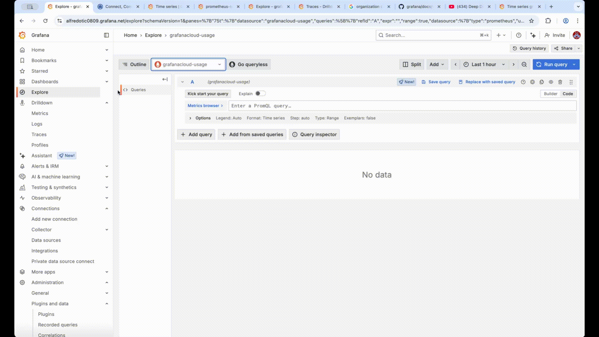

# requirements
* `docker run -d -p 3000:3000 grafana/grafana`

## Manage data sources
### ALWAYS configured OWN Grafana data source
* http://localhost:3000/
* Explore > click Data Sources

## Use query editors
### DIFFERENT query language / data source

