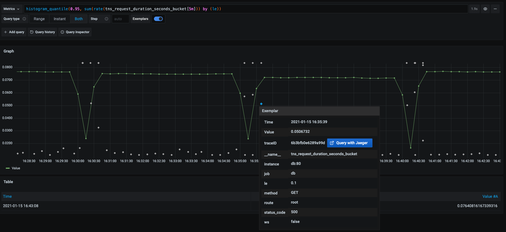
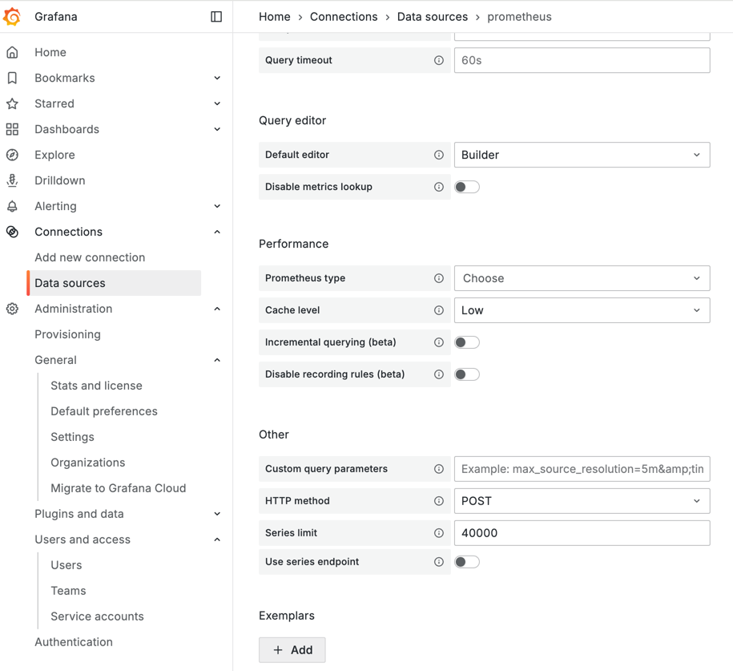

---
aliases:
  - ../data-sources/prometheus/
  - ../features/datasources/prometheus/
description: Guide for using Prometheus in Grafana
keywords:
  - grafana
  - prometheus
  - guide
labels:
  products:
    - cloud
    - enterprise
    - oss
menuTitle: Prometheus
title: Prometheus data source
weight: 1300
refs:
  build-dashboards:
    - pattern: /docs/grafana/
      destination: /docs/grafana/<GRAFANA_VERSION>/dashboards/build-dashboards/
    - pattern: /docs/grafana-cloud/
      destination: /docs/grafana/<GRAFANA_VERSION>/dashboards/build-dashboards/
  get-started-prometheus:
    - pattern: /docs/grafana/
      destination: /docs/grafana/<GRAFANA_VERSION>/getting-started/get-started-grafana-prometheus/#get-started-with-grafana-and-prometheus
    - pattern: /docs/grafana-cloud/
      destination: /docs/grafana/<GRAFANA_VERSION>/getting-started/get-started-grafana-prometheus/#get-started-with-grafana-and-prometheus
  provisioning-data-sources:
    - pattern: /docs/grafana/
      destination: /docs/grafana/<GRAFANA_VERSION>/administration/provisioning/#data-sources
    - pattern: /docs/grafana-cloud/
      destination: /docs/grafana/<GRAFANA_VERSION>/administration/provisioning/#data-sources
  set-up-grafana-monitoring:
    - pattern: /docs/grafana/
      destination: /docs/grafana/<GRAFANA_VERSION>/setup-grafana/set-up-grafana-monitoring/
    - pattern: /docs/grafana-cloud/
      destination: /docs/grafana/<GRAFANA_VERSION>/setup-grafana/set-up-grafana-monitoring/
  configure-grafana:
    - pattern: /docs/grafana/
      destination: /docs/grafana/<GRAFANA_VERSION>/setup-grafana/configure-grafana/
    - pattern: /docs/grafana-cloud/
      destination: /docs/grafana/<GRAFANA_VERSION>/setup-grafana/configure-grafana/
  administration-documentation:
    - pattern: /docs/grafana/
      destination: /docs/grafana/<GRAFANA_VERSION>/administration/data-source-management/
    - pattern: /docs/grafana-cloud/
      destination: /docs/grafana/<GRAFANA_VERSION>/administration/data-source-management/
  annotate-visualizations:
    - pattern: /docs/grafana/
      destination: /docs/grafana/<GRAFANA_VERSION>/dashboards/build-dashboards/annotate-visualizations/
    - pattern: /docs/grafana-cloud/
      destination: /docs/grafana-cloud/visualizations/dashboards/build-dashboards/annotate-visualizations/
  exemplars:
    - pattern: /docs/grafana/
      destination: /docs/grafana/<GRAFANA_VERSION>/fundamentals/exemplars/
    - pattern: /docs/grafana-cloud/
      destination: /docs/grafana/<GRAFANA_VERSION>/fundamentals/exemplars/
  intro-to-prometheus:
    - pattern: /docs/grafana/
      destination: /docs/grafana/<GRAFANA_VERSION>/fundamentals/intro-to-prometheus/
    - pattern: /docs/grafana-cloud/
      destination: /docs/grafana/<GRAFANA_VERSION>/fundamentals/intro-to-prometheus/
  configure-prometheus-data-source:
    - pattern: /docs/grafana/
      destination: /docs/grafana/<GRAFANA_VERSION>/datasources/prometheus/configure
    - pattern: /docs/grafana-cloud/
      destination: /docs/grafana/<GRAFANA_VERSION>/datasources/prometheus/configure
  annotate-visualizations:
    - pattern: /docs/grafana/
      destination: /docs/grafana/<GRAFANA_VERSION>/dashboards/build-dashboards/annotate-visualizations/
    - pattern: /docs/grafana-cloud/
      destination: /docs/grafana-cloud/visualizations/dashboards/build-dashboards/annotate-visualizations/
  recorded-queries:
    - pattern: /docs/grafana/
      destination: /docs/grafana/<GRAFANA_VERSION>/administration/recorded-queries/
    - pattern: /docs/grafana-cloud/
      destination: /docs/grafana/<GRAFANA_VERSION>/administration/recorded-queries/
  transformations:
   - pattern: /docs/grafana/
     destination: /docs/grafana/<GRAFANA_VERSION>/panels-visualizations/query-transform-data/transform-data/
   - pattern: /docs/grafana-cloud/
     destination: /docs/grafana-cloud/visualizations/panels-visualizations/query-transform-data/transform-data/
  alerting:
   - pattern: /docs/grafana/
     destination: /docs/grafana/<GRAFANA_VERSION>/alerting/
   - pattern: /docs/grafana-cloud/
     destination: /docs/grafana-cloud/alerting-and-irm/alerting/
  visualizations:
   - pattern: /docs/grafana/
     destination: /docs/grafana/<GRAFANA_VERSION>/panels-visualizations/visualizations/
   - pattern: /docs/grafana-cloud/
     destination: /docs/grafana-cloud/visualizations/panels-visualizations/visualizations/
  variables:
   - pattern: /docs/grafana/
     destination: /docs/grafana/<GRAFANA_VERSION>/dashboards/variables/
   - pattern: /docs/grafana-cloud/
     destination: /docs/grafana-cloud/visualizations/dashboards/variables/

---

# Prometheus data source

* Prometheus
  * open source database
  * scrape & store metrics
    * -- via -- telemetry collector agent
  * uses
    * monitoring
    * alerting

* Grafana
  * provides
    * native support for Prometheus
      * == ❌NOT need to install a plugin❌

* see
  - [What is Prometheus?](ref:intro-to-prometheus)
  - [Prometheus data model](https://prometheus.io/docs/concepts/data_model/)
  - [Getting started](https://prometheus.io/docs/prometheus/latest/getting_started/)
  - [Configure the Prometheus data source](ref:configure-prometheus-data-source)
  - [Prometheus query editor](query-editor/)
  - [Template variables](template-variables/)

## Exemplars

* **exemplar**
  * == specific trace / 
    * == measurement / taken | given time interval
  * vs metrics vs traces
    * metrics
      * provide
        * aggregated view of your system
    * traces
      * provide
        * detailed view of individual requests
    * exemplars
      * == 👀bridge BETWEEN metrics & traces👀
        * == specific event's higher-cardinality metadata is associated -- with a -- traditional time series data
  * [MORE](ref:exemplars)
  * exemplar data + metric | Explore and in Dashboards

    
  * Data sources > Prometheus > Settings > Exemplars
    

## Prometheus API

* Prometheus data source
  * if you want to use with OTHER Prometheus-compatible projects ([Grafana Mimir](/docs/mimir/latest/), [Thanos](https://thanos.io/tip/components/query.md/)) -> implement the [Prometheus querying API](https://prometheus.io/docs/prometheus/latest/querying/api/)

## Grafana metrics | Prometheus

* Grafana 
  * 👀exposes metrics -- for -- Prometheus | `/metrics` endpoint 👀
  * includes a pre-built dashboard
  * [how to configure](ref:configure-prometheus-data-source)
  * [Internal Grafana metrics](ref:set-up-grafana-monitoring)

## Amazon Managed Service for Prometheus

* [Amazon Managed Service for Prometheus data source](https://grafana.com/grafana/plugins/grafana-amazonprometheus-datasource/)
  * replacement of Prometheus data source -- for -- Amazon Managed Service for Prometheus
