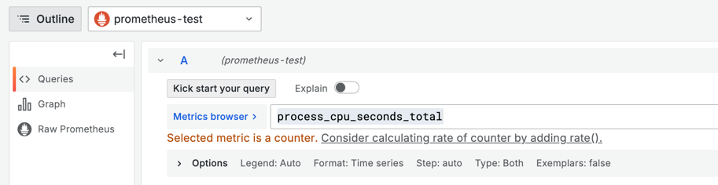
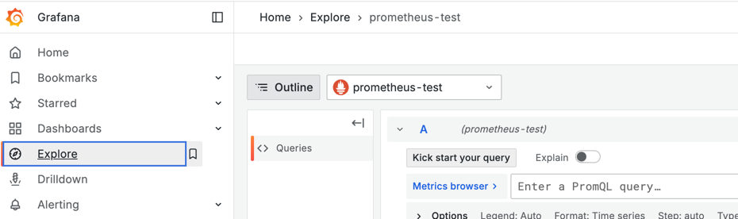
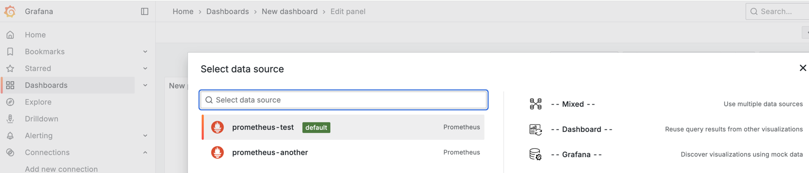

# requirements
* docker

# Configure the data source using the UI

* `docker compose up -d`
  * Problems:
    * Problem1: " chown */grafana/docs/sources/datasources/prometheus/configure/examples/grafana/provisioning: operation not permitted"
      * Solution: hit again the command OR `mkdir -p grafana`
* http://localhost:3000/
  * Connections > Add new connection > Prometheus
    * Prometheus server URL: http://host.docker.internal:9090 
* Grafana added Prometheus -- as -- data source
  * http://localhost:3000/
    * Explore > Prometheus
      * `prometheus_engine_query_duration_seconds`
        * Raw Prometheus == http://localhost:9090/query
      * `process_cpu_seconds_total`
        * Grafana makes suggestions

          
* Prometheus scrapes Grafana
  * http://localhost:9090/query
    * `grafana_apiserver_request_filter_duration_seconds_bucket`

# Configuration options
## Name
* compare it's SAME
  * Connections > Data sources > Prometheus > Name    vs    Explore > choose Prometheus 

## Default
* create another connection
### if on -> default data source | 
* Explore
  
* Dashboard panels -- Dashboards > Add visualization
  
  

## TODO:
