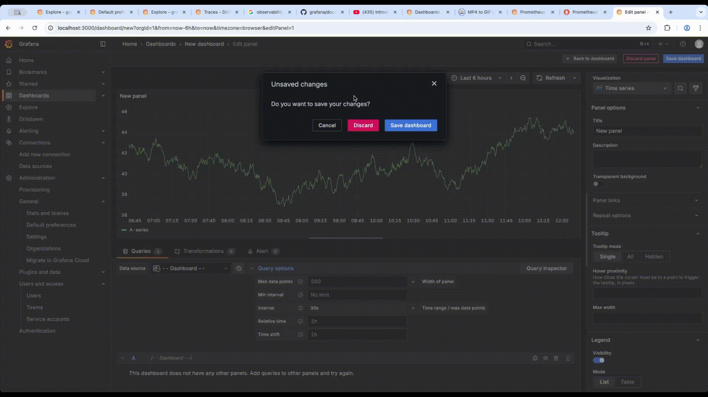

# Grafana metrics | Prometheus
## exposes metrics -- for -- Prometheus | `/metrics` endpoint
* `docker run -d -p 3000:3000 grafana/grafana`
* localhost:3000/metrics
## includes a pre-built dashboard
* Dashboard > Create dashboard > Add visualization > data source == Dashboard
  * Grafana time series visualization 

  
