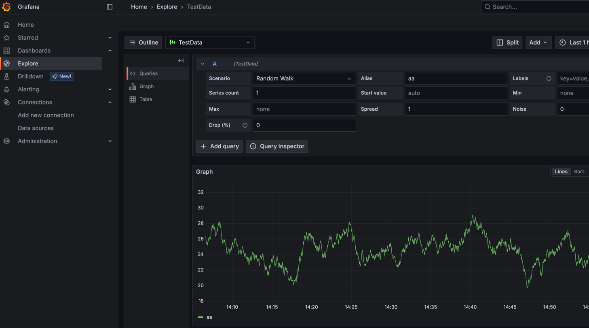
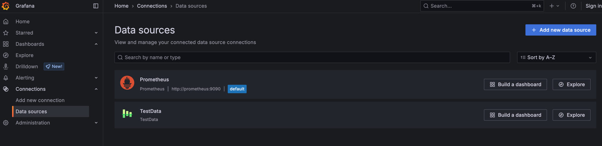

---
aliases:
  - ../data-sources/testdata/
  - ../features/datasources/testdata/
keywords:
  - grafana
  - dashboard
  - documentation
  - troubleshooting
  - panels
  - testdata
labels:
  products:
    - cloud
    - enterprise
    - oss
menuTitle: TestData
title: TestData data source
weight: 1500
refs:
  panels-visualizations:
    - pattern: /docs/grafana/
      destination: /docs/grafana/<GRAFANA_VERSION>/panels-visualizations/
    - pattern: /docs/grafana-cloud/
      destination: /docs/grafana/<GRAFANA_VERSION>/panels-visualizations/
  data-source-management:
    - pattern: /docs/grafana/
      destination: /docs/grafana/<GRAFANA_VERSION>/administration/data-source-management/
    - pattern: /docs/grafana-cloud/
      destination: /docs/grafana/<GRAFANA_VERSION>/administration/data-source-management/
---

# TestData data source

* 💡Grafana included💡
* provide
  * simulated time series data / any [panel](ref:panels-visualizations)
* uses
  * build your OWN fake & random time series data

## Configure the data source

* steps
  1.  Click **Connections** in the left-side menu.
  1.  Under Your connections, click **Data sources**.
  1.  Enter `TestData` in the search bar.
  1.  Select **TestData**.

## Create mock data


* | Explore, TestData

### Choose a scenario

* **Scenario** field
  * 💡generates simulated data -- for -- panels💡
    * ⚠️!= query editor⚠️ 
  * AVAILABLE ones
    - **Annotations**
    - **Conditional Error**
    - **CSV Content**
    - **CSV File**
    - **CSV Metric Values**
    - **Datapoints Outside Range**
    - **Exponential heatmap bucket data**
    - **Flame Graph**
    - **Grafana API**
    - **Grafana Live**
    - **Linear heatmap bucket data**
    - **Load Apache Arrow Data**
    - **Logs**
    - **No Data Points**
    - **Node Graph**
    - **Predictable CSV Wave**
    - **Predictable Pulse**
    - **Random Walk**
    - **Random Walk (with error)**
    - **Random Walk Table**
    - **Raw Frames**
    - **Simulation**
    - **Slow Query**
    - **Streaming Client**
    - **Table Static**
    - **Trace**
    - **USA generated data**

* **Alias** field
  * / EACH scenario
  * displayed | graph



## create a dashboard

* Connections, DataSources, build a dashboard | Testdata, save dashboard



## Use test data to report issues

* use case  
  * issue / involve time series data
* Reason:🧠easier to replicate and solve your issue🧠

## Use a custom version of TestData

* requirements
  * Grafana v10.3.0+

* steps
  * | "grafana.ini"
   ```ini
   [plugin.grafana-testdata-datasource]
   as_external = true
   ```
  * install TestData -- as an -- external plugin
