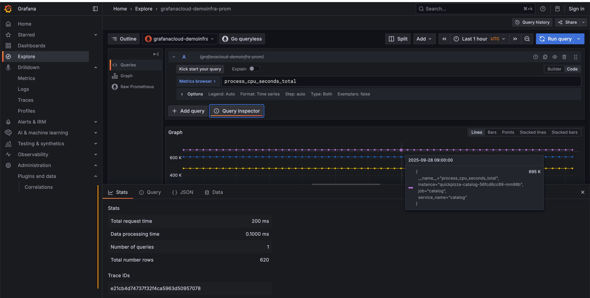

# Query inspector in Explore

* Query inspector
  * allows
    * inspects raw data
    * export data -- to a -- comma-separated values (CSV) file
    * export log results | .txt
    * view query requests
  * provides
    * | **Stats**,
      * your query's detailed statistics
    * | **Query**,
      * request response time,
    * | **{} JSON**,
      * data frame details
    * | **Data**,
      * shape of your data
  * 's functions
    * == debugging tool / "inspects" your query

## Query inspector UI

* Explore > hit query > **Query inspector**
  - **Stats tab -**
    - query's statistics (total request time, data processing time, data returned)
    - uses
      - troubleshoot your queries' performance
  - **Query tab -**
    - | Grafana queries the data source,
      - raw request
      - raw response data 
  - **JSON tab -**
    - ALLOWED displays
      - panel data
        - == JSON / data retrieved -- by the -- Explore's visualization 
      - [JSON data frame structure](https://grafana.com/developers/plugin-tools/key-concepts/data-frames)
        - == JSON / WITHOUT transformations NOR field configuration
  - **Data tab -**
    - == query's returned raw data / 
      - can be downloaded | 
        - .csv
        - if logs (== data source Loki) -> .txt 
  - **Error tab -**
    - == errors
    - requirements
      - query returns an error

