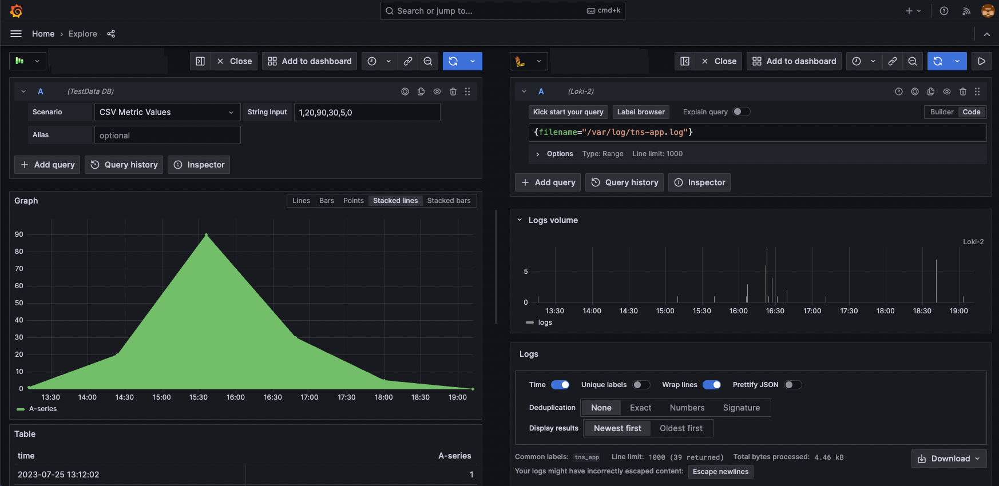

---
aliases:
  -
keywords:
  - explore
  - loki
  - logs
labels:
  products:
    - cloud
    - enterprise
    - oss
title: Get started with Explore
weight: 5
---

# Get started with Explore

* Explore
  * 👀if your data source supports graph & table data -> NO need to create a dashboard 👀
    * Reason: 🧠 Explore can display the results in both formats 🧠
    * _Example:_ Pyroscope
  * key features
    * Query editor
      * -- based on -- specific data source
      * allows, about queries
        * create
        * iterate
    * [Query history](https://grafana.com/docs/grafana/<GRAFANA_VERSION>/explore/query-management/)
      * allows, about queries
        * track
        * maintain
    * [Query inspector](https://grafana.com/docs/grafana/<GRAFANA_VERSION>/explore/explore-inspector/)
      * help troubleshoot query performance.
  * [youtube video](https://www.youtube.com/watch?v=1q3YzX2DDM4)
    * query builder
      * data source-specific
        * _Example:_ builder & code view
    * label
      * == key / value found | your data
        * values are key-specific
    * several views

## Before you begin

* requirements to access Explore
  * roles  
    * `editor` or
    * `administrator` or
    * enable [`viewers_can_edit` option](https://grafana.com/docs/grafana/<GRAFANA_VERSION>/setup-grafana/configure-grafana/#viewers_can_edit)

* roles
  * see
    * [Role and permissions](https://grafana.com/docs/grafana/<GRAFANA_VERSION>/administration/roles-and-permissions/)
    * [Role-based access control (RBAC)](https://grafana.com/docs/grafana/<GRAFANA_VERSION>/administration/roles-and-permissions/access-control/) | Grafana Enterprise
    * if you are using Grafana Cloud -> open a [support ticket | Cloud Portal](/https://grafana.com/auth/sign-in) -- to enable the --  `viewers_can_edit` option

## Explore elements

* Explore
  * == toolbar + outline + query editor + ability to add multiple queries + query history + query inspector
    * **Outline**
      * see [Content outline](#content-outline)
    * **Toolbar**
      * access to -- frequently used -- 
        * tools
        * settings
    * **Data source picker**
      * select a data source
    * **Split**
      * see [Split and compare](#split-and-compare)
    * **Add your exploration | dashboard**
      * uses
        * declare an incident,
        * create a forecast,
        * detect outliers
    * **Time picker**
      * see [Time picker](#time-picker)
    * **Run query**
    * **Query editor**
      * :=interface | you construct the query
        * 👀if you select **Mixed** | data source picker -> you can run queries | MULTIPLE data sources👀 
      * 's elements differ -- based on -- data source
    * **+Add query**
      * add ADDITIONAL queries
    * **Query history**
      * see [Query history](query-management.md#query-history) 
    * **Query inspector**
      * see [Query inspector in Explore](explore-inspector)

## Access Explore

* TODO:
To access Explore:

1. Click on **Explore** in the left side menu.

   To start with an existing query from a dashboard panel, select the Explore option from the Panel menu in the upper right. This opens an Explore page with the panel's query, enabling you to tweak or iterate the query outside your dashboard.

   

1. Select a data source from the drop-down in the upper left.

1. Using the query editor provided for the specific data source, begin writing your query. Each query editor differs based on each data source's unique elements.

Some query editors provide a **Kick start your query** option, which gives you a list of basic pre-written queries. Refer to [Use query editors](https://grafana.com/docs/grafana/<GRAFANA_VERSION>/datasources/#use-query-editors) to see how to use various query editors. For general information on querying data sources in Grafana, refer to [Query and transform data](https://grafana.com/docs/grafana/<GRAFANA_VERSION>/panels-visualizations/query-transform-data/).

Based on specific data source, certain query editors allow you to select the label or labels to add to your query. Labels are fields that consist of key/value pairs representing information in the data. Some data sources allow for selecting fields.

1. Click **Run query** in the upper right to run your query.

## Content outline

* == side navigation bar /
  * keeps track of the
    * queries
    * visualization panels
  * if you click | ANY panel icon -> navigate to that panel

## Split and compare

* allows
  * compare visualizations side -- by -- side | 1! page /
    * able to set different
      * data source,
      * metrics
      * label filters
      * time pickers
        * if you click | time-sync button -> set SAME time frames | BOTH sides
* if you want to delete 1 side -> click **Close** | one of those 

* _Example:_ 

    

## Time picker

* allows
  * selecting a time range /
    * allowed types
      * absolute time range
      * relative
      * change timezone
      * fiscal year
    * **last hour**
      * default one
* see
  * [Set dashboard time range](https://grafana.com/docs/grafana/<GRAFANA_VERSION>/dashboards/use-dashboards/#set-dashboard-time-range) 
  * [control the time range -- via -- URL](https://grafana.com/docs/grafana/<GRAFANA_VERSION>/dashboards/use-dashboards/#control-the-time-range-using-a-url)

## Share Explore URLs

When using Explore, the URL in the browser address bar updates as you make changes to the queries. You can share or bookmark this URL.

{}
Explore may generate long URLs, which some tools, like messaging or videoconferencing applications, might truncate due to fixed message lengths. In such cases, Explore displays a warning and loads a default state.
If you encounter issues when sharing Explore links in these applications, you can generate shortened links. See [Share shortened link](#share-shortened-link) for more information.
{}

### Generate Explore URLs from external tools

Because Explore URLs have a defined structure, you can build a URL from external tools and open it in Grafana. The URL structure is:

```
http://<grafana_url>/explore?panes=<panes>&schemaVersion=<schema_version>&orgId=<org_id>
```

where:

- `org_id` is the organization ID
- `schema_version` is the schema version (should be set to the latest version which is `1`)
- `panes` is a URL-encoded JSON object of panes, where each key is the pane ID and each value is an object matching the following schema:

```
{
  datasource: string; // the pane's root datasource UID, or `-- Mixed --` for mixed datasources
  queries: {
    refId: string; // an alphanumeric identifier for this query, must be unique within the pane, i.e. "A", "B", "C", etc.
    datasource: {
      uid: string; // the query's datasource UID ie: "AD7864H6422"
      type: string; // the query's datasource type-id, i.e: "loki"
    }
    // ... any other datasource-specific query parameters
  }[]; // array of queries for this pane
  range: {
    from: string; // the start time, in milliseconds since epoch
    to: string; // the end time, in milliseconds since epoch
  }
}
```


The `from` and `to` also accept relative ranges defined in [Time units and relative ranges](https://grafana.com/docs/grafana/<GRAFANA_VERSION>/dashboards/use-dashboards/#time-units-and-relative-ranges).


## Share shortened link


Available in Grafana 7.3 and later versions.


The Share shortened link capability allows you to create smaller and simpler URLs of the format `/goto/:uid` instead of using longer URLs with query parameters. To create a shortened link to the executed query, click the **Share** option in the Explore toolbar.

A shortened link that's not accessed automatically gets deleted after a [configurable period](https://grafana.com/docs/grafana/<GRAFANA_VERSION>/setup-grafana/configure-grafana/#short_links), which defaults to seven days. However, if the link is accessed at least once, it will not be deleted.

### Share shortened links with absolute time


Available in Grafana 10.3 and later versions.


Shortened links have two options: relative time (e.g., from two hours ago to now) or absolute time (e.g., from 8am to 10am). By default, sharing a shortened link copies the selected time range, whether it's relative or absolute.

To create a short link with an absolute time:

1. Click the dropdown button next to the share shortened link button.
1. Select one of the options under **Time-Sync URL Links**.

This ensures that anyone receiving the link will see the same data you see, regardless of when they open it. Your selected time range will remain unaffected.

## Next steps

Now that you are familiar with Explore you can:

- [Build dashboards](https://grafana.com/docs/grafana/<GRAFANA_VERSION>/dashboards/build-dashboards/)
- Create a wide variety of [visualizations](https://grafana.com/docs/grafana/<GRAFANA_VERSION>/panels-visualizations/visualizations/)
- [Work with logs](https://grafana.com/docs/grafana/<GRAFANA_VERSION>/explore/logs-integration/)
- [Work with traces](https://grafana.com/docs/grafana/<GRAFANA_VERSION>)
- [Create and use correlations](https://grafana.com/docs/grafana/<GRAFANA_VERSION>/explore/correlations-editor-in-explore/)
