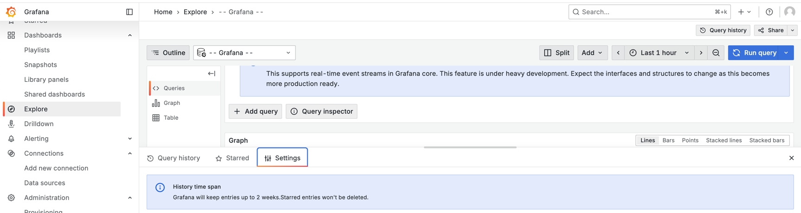

---
keywords:
  - explore
  - loki
  - logs
labels:
  products:
    - cloud
    - enterprise
    - oss
title: Query management in Explore
weight: 10
refs:
  saved-queries:
    - pattern: /docs/grafana/
      destination: /docs/grafana/<GRAFANA_VERSION>/panels-visualizations/query-transform-data/#saved-queries
    - pattern: /docs/grafana-cloud/
      destination: /docs/grafana-cloud/visualizations/panels-visualizations/query-transform-data/#saved-queries
---

# Query management in Explore

* Grafana Explore
  * allows you to
    * investigate query requests & responses & statistics

## Query history

* Query history
  * == 👀queries / created | Explore👀
    * stored | Grafana database
    * ❌NOT shared with OTHER users❌
  * == 
    * **Query history tab-**
      * == history of ALL your queries + options for searching & managing
    * **Starred tab**
      * == ALL your starred queries
    * **Settings tab**
      * == CUSTOMIZABLE options
  * 's retention period 
    * ⚠️2 weeks⚠️
      * if queries' age > 2 weeks -> AUTOMATICALLY deleted
        * EXCEPTION: Starred queries

* steps to view
  1. Explore > **Query history**

### Query history tab

* / EACH individual query
  - Run & re-run the query
  - Create and/or edit a comment.
  - Copy a query to the clipboard.
  - Copy a shortened link with the query to the clipboard.
  - Delete a query.
  - Star a query.
  - Add a query from your history -- to -- your [saved queries](ref:saved-queries)

### Query history Starred tab

* ALL starred queries
  * displayed | **Starred** tab
  * allows
    * give quick access WITHOUT re-querying

#### Filter query history

* filter is ALLOWED | **Query history** & **Starred**
  * ways to filter
    * by data source
      * if you want to filter queries / **Mixed** data source -> filter for "Mixed"
    * by date
    * by keywords

### Query history Settings tab

* allows
  * change the default active tab BETWEEN "Query history" -- & -- "Starred"
