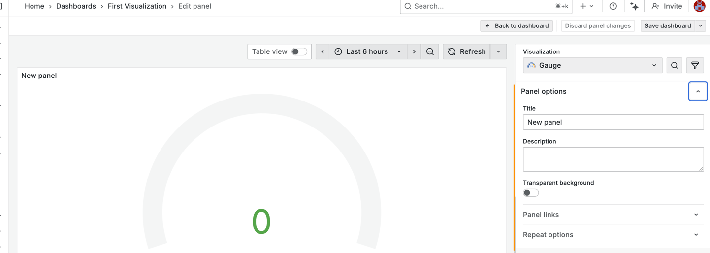
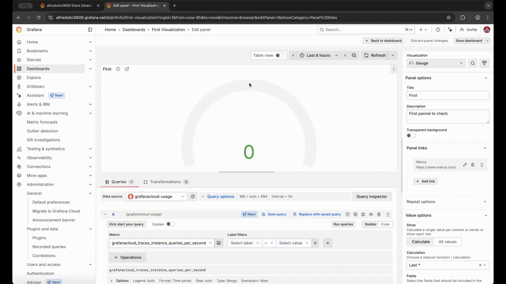

---
aliases:
  - ../panels/add-panels-dynamically/
  - ../panels/configure-panel-options/
  - ../panels/repeat-panels-or-rows/
  - ../panels/working-with-panels/add-title-and-description/
  - ../panels/working-with-panels/view-json-model/
keywords:
  - panel
  - dynamic
  - add
  - title
  - description
  - JSON model
labels:
  products:
    - cloud
    - enterprise
    - oss
menuTitle: Configure panel options
title: Configure panel options
description: Add titles, descriptions, repeating rows and panel links
weight: 50
refs:
  global-variables:
    - pattern: /docs/grafana/
      destination: /docs/grafana/<GRAFANA_VERSION>/dashboards/variables/add-template-variables/#global-variables
    - pattern: /docs/grafana-cloud/
      destination: /docs/grafana-cloud/visualizations/dashboards/variables/add-template-variables/#global-variables
  links-to-the-panel:
    - pattern: /docs/grafana/
      destination: /docs/grafana/<GRAFANA_VERSION>/dashboards/build-dashboards/manage-dashboard-links/#panel-links
    - pattern: /docs/grafana-cloud/
      destination: /docs/grafana-cloud/visualizations/dashboards/build-dashboards/manage-dashboard-links/#panel-links
  configure-repeating-rows:
    - pattern: /docs/grafana/
      destination: /docs/grafana/<GRAFANA_VERSION>/dashboards/build-dashboards/create-dashboard/#configure-repeating-rows
    - pattern: /docs/grafana-cloud/
      destination: /docs/grafana-cloud/visualizations/dashboards/build-dashboards/create-dashboard/#configure-repeating-rows
  set-up-generative-ai-features-for-dashboards:
    - pattern: /docs/grafana/
      destination: /docs/grafana/<GRAFANA_VERSION>/dashboards/manage-dashboards/#set-up-generative-ai-features-for-dashboards
    - pattern: /docs/grafana-cloud/
      destination: /docs/grafana-cloud/visualizations/dashboards/manage-dashboards/#set-up-generative-ai-features-for-dashboards
  variables-you-have-defined:
    - pattern: /docs/grafana/
      destination: /docs/grafana/<GRAFANA_VERSION>/dashboards/variables/
    - pattern: /docs/grafana-cloud/
      destination: /docs/grafana-cloud/visualizations/dashboards/variables/
  grafana-llm-plugin:
    - pattern: /docs/grafana/
      destination: /docs/grafana-cloud/alerting-and-irm/machine-learning/configure/llm-plugin/
    - pattern: /docs/grafana-cloud/
      destination: /docs/grafana-cloud/alerting-and-irm/machine-learning/configure/llm-plugin/
---

# Configure panel options

* | panel editor's panel options,
  * == settings / COMMON | ALL visualizations 

## Panel options

* allows
  * provide panel's basic information
  * define basic display elements

| Option                 | Description                                                                                                                                                                                                                        |
| ---------------------- |------------------------------------------------------------------------------------------------------------------------------------------------------------------------------------------------------------------------------------|
| Title                  | == text / appears \| top of your (panel editor's panel & dashboard's panel)   ALLOWED to use: [variables you have defined](ref:variables-you-have-defined)   ❌NOT ALLOWED to use [global variables](ref:global-variables)❌ |
| Description            | == text / appears \| panel's upper-left corner tooltip   ALLOWED to use: [variables you have defined](ref:variables-you-have-defined)   ❌NOT ALLOWED to use [global variables](ref:global-variables)❌                      |
| Transparent background | panel's background color == OR != dashboard's background color                                                                                                                                                                     |
| Panel links            | [links to the panel](ref:links-to-the-panel)   == shortcuts -- to -- OTHER dashboards, panels, and external websites   == iconS \| panel title                                                                             |
| Repeat options         | repeat the panel / EACH selected variable's value   [here](#configure-repeating-panels)                                                                                                                                        |

* if you want to populate **Title** & **Description** fields -- via -- generative AI -> use [Grafana LLM plugin](ref:grafana-llm-plugin)
  * [how to set up](ref:set-up-generative-ai-features-for-dashboards)

## Configure repeating panels

* dynamic panel
  * == panel / created -- based on the -- variable's value
    * variables dynamically change your queries | ALL dashboard's panels 
  * [how to configure repeating rows](ref:configure-repeating-rows)
  * _Example:_ [dashboard / repeating panels](https://play.grafana.org/goto/yfZOReUNR?orgId=1)
  * repeat options
    * **Disable repeating**
    * choose your variable
  * repeat direction
    * **Horizontal**
      * arrange panels side-by-side
      * Grafana adjusts the repeated panel's width 
      * | this row,
        * ❌NOT possible to mix OTHER panels❌
    * **Vertical**
      * Arrange panels in a column
      * repeated panels' width == original repeated panel's width

* requirements
  * query / has multi-value variable
