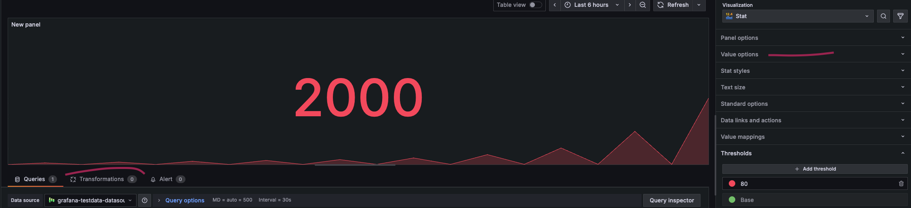

---
aliases:
  - ../../panels/calculation-types/ # /docs/grafana/<GRAFANA_VERSION>/panels/calculation-types/
  - ../../panels/calculations-list/ # /docs/grafana/<GRAFANA_VERSION>/panels/calculations-list/
  - ../../panels/reference-calculation-types/ # /docs/grafana/<GRAFANA_VERSION>/panels/reference-calculation-types/
  - ../calculation-types/ # /docs/grafana/<GRAFANA_VERSION>/panels-visualizations/calculation-types/
labels:
  products:
    - cloud
    - enterprise
    - oss
title: Calculation types
description: Learn about the calculations you can apply to your data
weight: 1100
---

# Calculation types

* ⚠️requirements⚠️
  * visualizations
    * bar gauge, 
    * gauge,
    * stat,
    * table visualizations

* 💡ways to apply calculation types💡
  * Transformations > Reduce > Calculations
  * Value options > Calculate > Calculation

| Calculation        | Description                                                                                                                                  |
| :----------------- |:---------------------------------------------------------------------------------------------------------------------------------------------|
| 1st % - 99th %     | 1st - 99th percentile value.                                                                                                                 |
| All nulls          | if ALL values are null -> true                                                                                                               |
| All unique values  | Array with all unique values                                                                                                                 |
| All values         | Array with all values                                                                                                                        |
| All zeros          | True when all values are 0                                                                                                                   |
| Change count       | Number of times the field's value changes                                                                                                    |
| Count              | Number of values in a field / ⚠️exclude null⚠️                                                                                               |
| Delta              | Cumulative change in value / ⚠️ONLY counts increments⚠️. OTHERWISE, reset   uses: counter metrics, disk usage growth, memory allocations |
| Difference         | Difference BETWEEN first & last value    ⚠️!= Delta⚠️                                                                                    |
| Difference percent | Percentage change between first and last value of a field                                                                                    |
| Distinct count     | Number of unique values in a field                                                                                                           |
| First              | First value in a field                                                                                                                       |
| First\* (not null) | First, not null value in a field (also excludes NaNs)                                                                                        |
| Last               | Last value in a field                                                                                                                        |
| Last\* (not null)  | Last, not null value in a field (also excludes NaNs)                                                                                         |
| Max                | Maximum value of a field                                                                                                                     |
| Median             | Median value of all values in a field                                                                                                        |
| Mean               | Mean value of all values in a field                                                                                                          |
| Min                | Minimum value of a field                                                                                                                     |
| Min (above zero)   | Minimum, positive value of a field                                                                                                           |
| Range              | Difference between maximum and minimum values of a field                                                                                     |
| StdDev             | Standard deviation of all values in a field                                                                                                  |
| Step               | Minimal interval between values of a field                                                                                                   |
| Total              | Sum of all values in a field                                                                                                                 |
| Variance           | Variance of all values in a field                                                                                                            |
