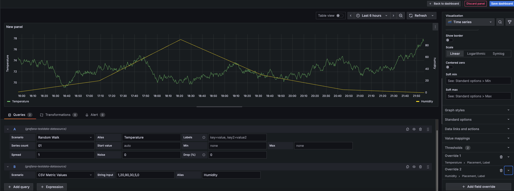

* `docker run -d -p 3000:3000 grafana/grafana`
* http://localhost:3000/
  * admin / admin

# if you have >1 y-axis -> assign DIFFERENT labels -- via -- override
* **Dashboards** > **New** > **Add visualization** > 
  * Query1 > Datasource=TestData > 
    * Scenario = Random walk
    * Alias = Temperature -> Y-axis
  * Query 2 > 
    * Scenario = CSV metric values
    * String input: 1,20,90,30,5,0
    * Alias = Humidity -> Y-axis
* overrideS
  * override1
    * Fields with name = temperature
    * Add override property
      * Axis > Placement=Left
      * Axis > Label = temperature
  * override2
    * Fields with name = humidity
    * Add override property
      * Axis > Placement=Left
      * Axis > Label = humidity

# Width
* | PREVIOUS diagram,
  * adjust it
    * -> width reduced

# color
## text
* -- based on --
  * user > profile > Preferences > interface theme
## series
* -- based on --
  * standard options > color schema

# soft min & soft max
* **Dashboards** > **New** > **Add visualization** >
  * Query1 > Datasource=TestData > 
    * Scenario = CSV metric values
    * String input = 1,100.1,2,100.2,3,100.15,4,100.25,5,100.3
  * ⚠️IMPOSSIBLE to identify changes⚠️
  * if you set Axis > soft min = 99, soft max=102 ->
    * 👀if there are hits out -> it's expanded SOFTLY -> you detect changes in the below limit👀
