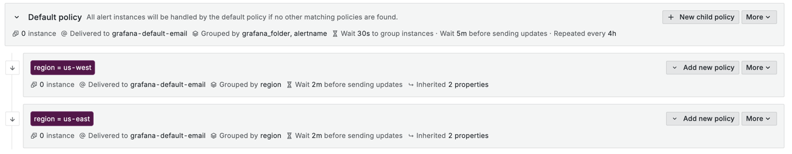
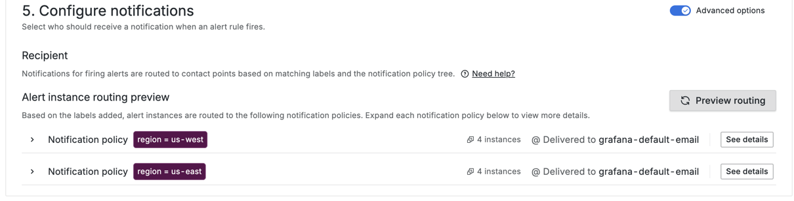

* [Youtube](https://www.youtube.com/watch?v=WZ8gqKIQ5Oc) 
* continuation of [Grafana Alert routing2 tutorial](http://www.grafana.com/tutorials/alerting-get-started-pt2/)

* goal
  - how alert rule grouping works
  - Create a notification policy / handle grouping.
  - Define alert rules | real-world scenario
  - Receive and review grouped alert notifications.

## requirements

### | Grafana OSS

* | [tutorial environment repository](https://www.github.com/grafana/tutorial-environment)
  * `docker compose up -d`

## steps
* `docker compose up -d`
* http://localhost:3000
  * admin/admin
### Setting up alert rule grouping

#### Notification Policy

* **Alerts & IRM > Alerting > Notification Policies** > Default policy > **+ New child policy**
  * child policy | 
    * label `region=us-west`  
      * **Label**
        * `region=us-west`
      * **Contact point**:
       - Select any one
      * **Continue matching subsequent sibling nodes**
        * on
          * == ALTHOUGH >= 1 labels match -> keep on evaluating
      * **Override grouping**
        * on
        * **Group by**
          * `region`
      * **Override general timings**
        * on
        * **Group interval**: `2m`
    * label `region=us-east`
      * **Label**
        * `region=us-east`
      * **Contact point**:
      - Select any one
      * **Continue matching subsequent sibling nodes**
        * on
          * == ALTHOUGH >= 1 labels match -> keep on evaluating
      * **Override grouping**
        * on
        * **Group by**
          * `region`
      * **Override general timings**
        * on
        * **Group interval**: `2m`



### Create an alert rule

* **Alerts & IRM > Alerting > Alert rules** > **+ New alert rule**
  * name: `High CPU usage - Multi-region`
  * Define query and alert condition
    * datasource: **TestData**
    * **Scenario**: **CSV Content**

     ```csv
     region,cpu-usage,service,instance
     us-west,35,web-server-1,server-01
     us-west,81,web-server-1,server-02
     us-east,79,web-server-2,server-03
     us-east,52,web-server-2,server-04
     us-west,45,db-server-1,server-05
     us-east,77,db-server-2,server-06
     us-west,82,db-server-1,server-07
     us-east,93,db-server-2,server-08
     ```
    * **Alert condition**: `Last` `IS ABOVE 75`
  * Add folders and labels
    * **Folder** > **+ New folder** > name: `Multi-region alerts`
  * Set evaluation behavior
    * **Evaluation group and interval** > new
      * name: `Multi-region group`
      * **Evaluation interval**: `1m`
  * Configure notifications
    * choose your default contact point
    * Advanced options: on
      * preview routing

    

#### Create a second alert rule

* Alerting > Alert rules > More > Duplicate
  * name: leave the suggested one
  * Define query and alert condition
    * values

   ```
   region,memory-usage,service,instance
   us-west,42,cache-server-1,server-09
   us-west,88,cache-server-1,server-10
   us-east,74,api-server-1,server-11
   us-east,90,api-server-1,server-12
   us-west,53,analytics-server-1,server-13
   us-east,81,analytics-server-2,server-14
   us-west,77,analytics-server-1,server-15
   us-east,94,analytics-server-2,server-16
   ```

### Receiving grouped alert notifications

* Alerting > Active notifications
  * grouped by region

* TODO: When the configured alert rule detects CPU or memory usage higher than 75% across multiple regions, it will evaluate the metric every minute
* If the condition persists, notifications will be grouped together, with a Group wait of 30 seconds before the first alert is sent
* Follow-up notifications for the same alert group will be sent at intervals of 2 minutes (US-west alert instances only), increasing the frequency of the grouped alert notifications
* US-east instances follow-up notifications should be sent at the default interval of 5 minutes
* If the condition continues for an extended period, a Repeat interval of 4 hours ensures that the alert is only resent if the issue persists.

As a result, our notification policies should route three notifications: one grouped notification grouping both CPU and memory alert instances from the us-west region and two separate notifications with alert instances from the us-east region.

Grouped notifications example:

```json
{
  "receiver": "US-West-Alerts",
  "status": "firing",
  "alerts": [
    {
      "status": "firing",
      "labels": {
        "alertname": "High CPU usage - Multi-region",
        "grafana_folder": "Multi-region alerts",
        "instance": "server-05",
...
  {
    "status": "firing",
      "labels": {
        "alertname": "High Memory usage - Multi-region",
        "grafana_folder": "Multi-region alerts",
        "instance": "server-10",
      },

...}
```

_Detail of CPU and memory alert instances grouped into a single notification for us-west contact point._

```json
{
  "receiver": "US-East-Alerts",
  "status": "firing",
  "alerts": [
    {
      "status": "firing",
      "labels": {
        "alertname": "High CPU usage - Multi-region",
        "grafana_folder": "Multi-region alerts",
        "instance": "server-03",
        "region": "us-east",
        "service": "web-server-2"
...}}}
```

_Detail of CPU alert instances grouped into a separate notification for us-east contact point._

```json
{
  "receiver": "US-East-Alerts",
  "status": "firing",
  "alerts": [
    {
      "status": "firing",
      "labels": {
        "alertname": "High memory usage - Multi-region",
        "grafana_folder": "Multi-region memory alerts",
        "instance": "server-12",
        "region": "us-east"
...}}}
```


## Conclusion

* Fine-tuning **timing options**—including group wait, group interval, and repeat interval—further can reduce noise and ensures notifications remain actionable without overwhelming on-call engineers.

