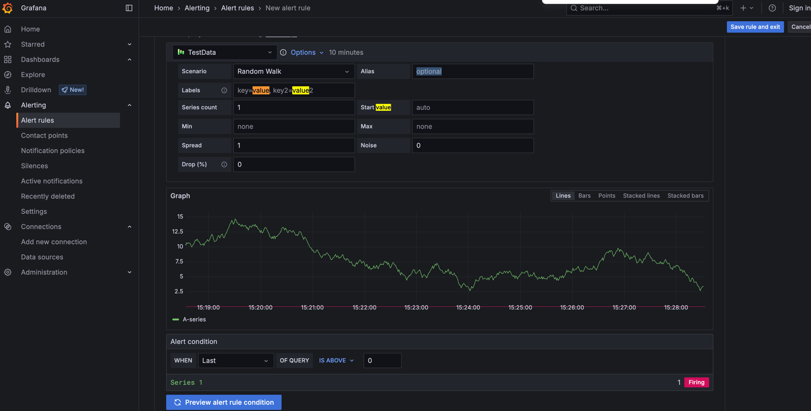
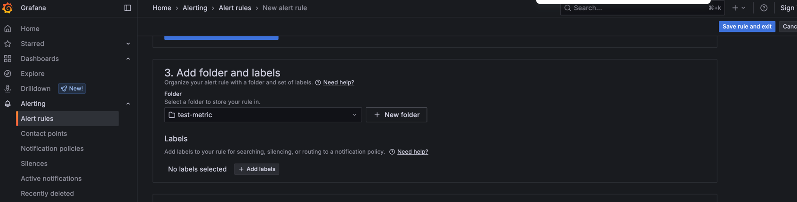

* goal
  * set up your first alert
  * alert in action -- via -- real-time data
  * send alert notifications

* [Youtube](https://www.youtube.com/watch?v=YVhKNbQNNss)

## requirements

* ways to run Grafana
  * **Grafana Cloud**
    * [Create your free account](http://www.grafana.com/auth/sign-up/create-user)
  * **Interactive learning environment**
    * [Killercoda](https://killercoda.com/grafana-labs/course/grafana/alerting-get-started/)
  * [**Grafana OSS**](https://github.com/dancer1325/grafana-tutorial-environment)

## Create a contact point

* -- based on -- [webhook integration](https://grafana.com/docs/grafana/latest/alerting/configure-notifications/manage-contact-points/integrations/webhook-notifier/)

* steps
  * create endpoint / receive the alert
    * [Webhook.site](https://webhook.site/)
    * copy Your unique URL
  * create the contact point
    1. Navigate to **Alerts & IRM** -> **Alerting** -> **Contact points**.
    1. Click **+ Add contact point**.
    1. Enter a name for the contact point.
    1. From the **Integration** list, select **Webhook**.
    1. In the **URL** field, copy in your Webhook URL.
    1. Configure [additional settings](#webhook-settings)
       2. OPTIONAL
    1. Click **Save contact point**
  * test
    * Alerting, contact points, click one created, test
      * Problems: 
        * Problem1: it can NOT reach external urls
          * Attempt1:
            ```dockercompose.yml
            - "GF_ALERTING_NOTIFICATION_SKIP_TLS_VERIFY=true"
            ```
          * Attempt2:
            ```dockercompose.yml
            - "GF_ALERTING_NOTIFICATION_TIMEOUT=30s"
            - "PYTHONHTTPSVERIFY=0"
            - "CURL_CA_BUNDLE="
            - "REQUESTS_CA_BUNDLE="
            ```
          * Attempt3:
            * Grafana alerts work
            ```dockercompose.yml
            docker exec grafana-tutorial-environment-grafana-1 curl -k https://webhook.site/dad264f5-c395-4932-b6b2-cf5b0aef1656
            ```
          * Attempt4:
            ```dockercompose.yml
            - "GF_ALERTING_SKIP_TLS_VERIFY=true"
            ```
            ```
            docker-compose exec grafana curl -k -X POST https://webhook.site/dad264f5-c395-4932-b6b2-cf5b0aef1656 -H "Content-Type: application/json" -d '{"test": "message from docker"}'
            # works | container, BUT NOT -- via -- Grafana
            ```
            ```dockercompose.yml
            - "GF_UNIFIED_ALERTING_DISABLED_LABELS=false"
            - "GF_ALERTING_EXECUTE_ALERTS=true"
            ```
          * Attempt5:
            ```dockercompose.yml
            - ./grafana.ini:/etc/grafana/grafana.ini
            ```
            ```grafana.ini
            skip_tls_verify = true
            ```
          * Solution: ⭐️OPTIONAL web settings, Disable certificate verification⭐️
  * | [Webhook.site](https://webhook.site/),
    * there's a `POST /` entry


## Create an alert

* [alert rule](https://grafana.com/docs/grafana/latest/alerting/alerting-rules/create-grafana-managed-rule/)

* steps
  1. Navigate to **Alerts & IRM > Alerting > Alert rules**
  2. **New alert rule**
  3. Enter alert rule name

### Define query and alert condition

* goal
  * Grafana-managed alert rule creation's default options 
    * == query + threshold expression (`WHEN` field)

* Grafana's [test data source](https://grafana.com/docs/grafana/latest/datasources/testdata/)
  * 👀creates simulated time series data👀

* steps
  1. Select the **TestData**
  1. In the **Alert condition** section:
     - _Scenario_ == **Random Walk** 
     - Alert condition (== threshold condition), `Last` `IS ABOVE 0`
  1. Click **Preview alert rule condition** to run the query
     * 's return
       * random time series data
       * 's state == `Firing`


### Add folders and labels

1. | **Folder**, **+ New folder**, enter a name

  

### Set evaluation behavior

* [alert rule evaluation](https://grafana.com/docs/grafana/latest/alerting/fundamentals/alert-rules/rule-evaluation/)

### Configure notifications

* steps
  * **Contact point**, **Webhook**
  * **Save rule and exit**

## Trigger and resolve an alert

Now that the alert rule has been configured, you should receive alert [notifications](http://grafana.com/docs/grafana/next/alerting/fundamentals/alert-rule-evaluation/state-and-health/#notifications) in the contact point whenever alerts trigger and get resolved.

### Trigger an alert

Since the alert rule that you have created has been configured to always fire, once the evaluation interval has concluded, you should receive an alert notification in the Webhook endpoint.



The alert notification details show that the alert rule state is Firing , and it includes the value that made the rule trigger by exceeding the threshold of the alert rule condition. The notification also includes links to see the alert rule details, and another link to add a [Silence](http://grafana.com/docs/grafana/next/alerting/configure-notifications/create-silence/) to it.

### Resolve an alert

To see how a resolved alert notification looks like, you can modify the current alert rule threshold.

To edit the Alert rule:

1. **Navigate to Alerting** > **Alert rules**.
1. Click on the metric-alerts folder to display the alert that you created earlier
1. Click the **edit** button on the right hand side of the screen
1. Increment the Threshold expression to 1.
1. Click **Save rule and exit**.

By incrementing the threshold, the condition is no longer met, and after the evaluation interval has concluded (1 minute approx.), you should receive an alert notification with status **“Resolved”**.
