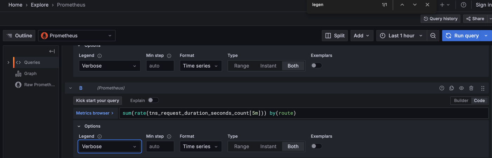
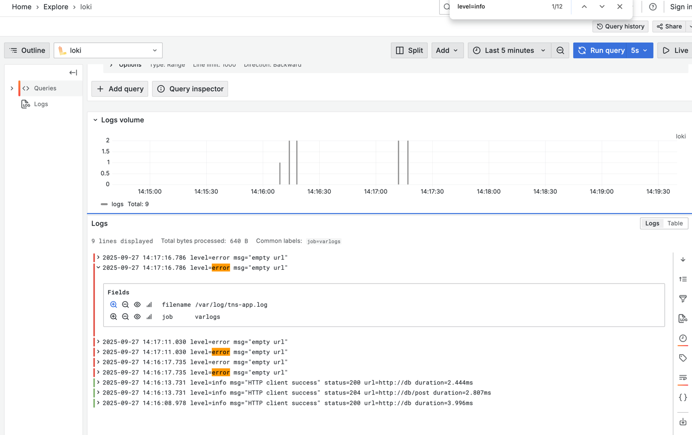
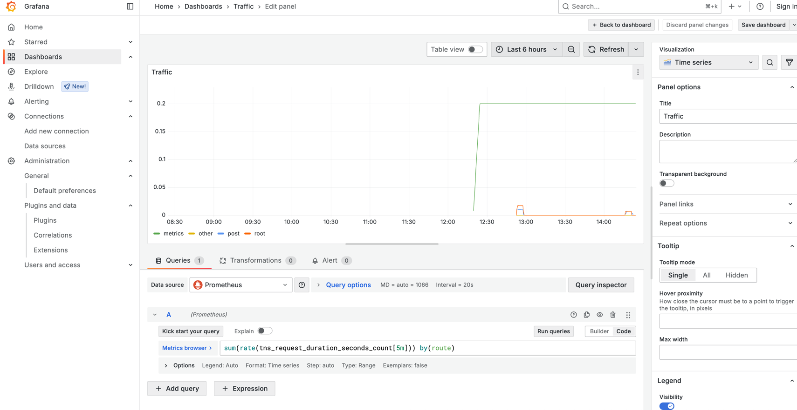
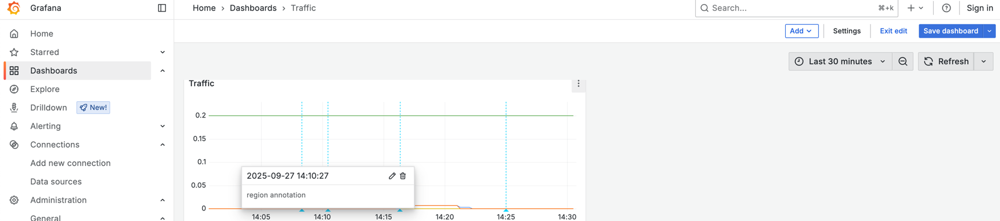
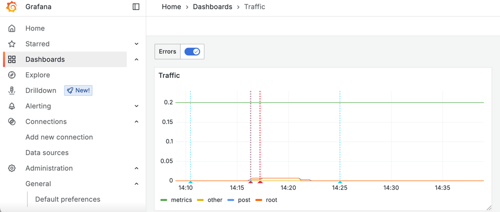

## Introduction

* goal
  * how to use Grafana -- as -- your application's monitoring solution
    - Explore metrics and logs
    - Build dashboards
    - Annotate dashboards
    - Set up alert rules

* [Youtube](https://www.youtube.com/embed/videoseries?si=ueLa_QEXz20IWnGt&amp;list=PLDGkOdUX1Ujo27m6qiTPPCpFHVfyKq9jT)

### Prerequisites

* locally
  - [Docker](https://docs.docker.com/install/)
  - [Docker Compose](https://docs.docker.com/compose/) (included in Docker for Desktop for macOS and Windows)
  - [Git](https://git-scm.com/)
* [Browser - Killercoda](https://killercoda.com/grafana-labs/course/grafana/grafana-fundamentals)
  * [Grafana Killercoda repository](https://github.com/grafana/killercoda)

## Set up the sample application

* Reason:🧠demonstrate features | Grafana🧠

* steps
  * download the files | your local machine
  * `git clone https://github.com/grafana/tutorial-environment.git`
  * `docker-compose up -d`

## Explore your metrics

* goal
  * create ad-hoc queries 

* Grafana Explore
  * == workflow
  * uses
    * troubleshooting
    * data exploration
  * 's modes
    * Builder OR Code

* legend
  * / EACH query

  

* steps
  * http://localhost:3000/explore
    * `tns_request_duration_seconds_count`
      * == counter 
    * **Run Query** / EACH **5s**
    * `rate(tns_request_duration_seconds_count[5m])`
      * == rate of change
    * `sum(rate(tns_request_duration_seconds_count[5m])) by(route)`
  * http://localhost:8081
    * generate traffic -- by -- adding new links OR refresh the browser
  * http://localhost:3000/explore
    * select **Last 15 minutes**
    * `sum(rate(tns_request_duration_seconds_count[5m])) by(route)`

## check your logs
### Add a logging data source

* steps
  * http://localhost:3000/datasources
    * == Connections > Data sources
    * **Add new data source** > Loki
      * `http://loki:3100`
      * **Save & Test**

### Explore your logs

* steps
  * http://localhost:3000/explore
    * **Loki**
      * > Code
        * `{filename="/var/log/tns-app.log"}`
      * **Run Query** / EACH **5s**
      * `level=error msg="empty url"`
        * == filter by substring
      * EACH bar's height
        * == NUMBER of logs / were generated / EACH time
  * http://localhost:8081,
    * submit WITHOUT adding URL
  * http://localhost:3000/explore
    * **Loki**
      * `{filename="/var/log/tns-app.log"} |= "error"`
    * click | EACH log / see more details



## Build a dashboard

* steps
  * http://localhost:3000/dashboards > **New** > **Dashboard**
    * **Add visualization** > Prometheus
      * **Query**
        * `sum(rate(tns_request_duration_seconds_count[5m])) by(route)`
      * **Panel options**
        * Title == "Traffic"
      * **Save dashboard**
      * **Legend**
        * `route`
      * **Y-axis**
        * `log(10)`
      * **X-axis**
        * `time`



## Annotate events

* uses
  * describe events

* types
  * annotations
  * region annotations
    * == annotation | time interval

* steps
  * http://localhost:3000/dashboards > panel
    * annotation
      * click anywhere | panel, **Add annotation**
    * region annotation
      1. Ctrl (or Cmd on macOS) & hold + click & drag



### annotations to correlate logs -- with -- metrics

* querying annotations
  * == generate AUTOMATICALLY annotations -- from -- a data source /
    * 💡displayed | OTHER panel' data sources💡
      * == ⭐️correlate logs -- with -- metrics⭐️
  * uses
    * regular occurring events
      * _Examples:_ deploying a new release 
  * allows
    * correlate data sources
    * \+ alert rules

* steps
  * Dashboard > choose 1 > **Dashboard settings** > **Annotations** > **Add annotation query**
    * **Name** == **Errors**
    * **Data source** == **Loki**
    * **Query**
      ```
      {filename="/var/log/tns-app.log"} |= "error"
      ```
  * http://localhost:8081
    *  submit WITHOUT adding URL
  * Dashboard > PREVIOUSLY chosen
    * annotation query are displayed | panel



## Create a Grafana-managed alert rule

* Grafana-managed alert rule
  * | Grafana 9+,
    * default alerting method
* goal
  * | trigger an alert rule,
    * send a test message -- to a -- dummy endpoint

* TODO:

1. A _Contact point_ - A Contact point defines how Grafana delivers an alert instance. When the conditions of an _alert rule_ are met, Grafana notifies the contact points, or channels, configured for that alert rule.

   <!-- INTERACTIVE ignore START -->

   
   An [alert instance](https://grafana.com/docs/grafana/latest/alerting/fundamentals/#alert-instances) is a specific occurrence that matches a condition defined by an alert rule, such as when the rate of requests for a specific route suddenly increases.
   
   <!-- INTERACTIVE ignore END -->

   

   > An [alert instance](https://grafana.com/docs/grafana/latest/alerting/fundamentals/#alert-instances) is a specific occurrence that matches a condition defined by an alert rule, such as when the rate of requests for a specific route suddenly increases.
   > 

   Some popular channels include:
   - [Email](https://grafana.com/docs/grafana/latest/alerting/configure-notifications/manage-contact-points/integrations/configure-email/)
   - [Webhooks](https://grafana.com/docs/grafana/latest/alerting/configure-notifications/manage-contact-points/integrations/webhook-notifier/)
   - [Telegram](https://grafana.com/docs/grafana/latest/alerting/configure-notifications/manage-contact-points/integrations/configure-telegram/)
   - [Slack](https://grafana.com/docs/grafana/latest/alerting/configure-notifications/manage-contact-points/integrations/configure-slack/)
   - [PagerDuty](https://grafana.com/docs/grafana/latest/alerting/configure-notifications/manage-contact-points/integrations/pager-duty/)

1. An _Alert rule_ - An Alert rule defines one or more _conditions_ that Grafana regularly evaluates. When these evaluations meet the rule's criteria, the alert rule is triggered.

To begin, let's set up a webhook contact point. Once we have a usable endpoint, we write an alert rule and trigger a notification.

<!-- INTERACTIVE page step8.md END -->

<!-- INTERACTIVE page step9.md START -->

### Create a contact point for Grafana-managed alert rules

In this step, we set up a new contact point. This contact point uses the _webhooks_ channel. In order to make this work, we also need an endpoint for our webhook channel to receive the alert notification. We can use [Webhook.site](https://webhook.site/) to quickly set up that test endpoint. This way we can make sure that our alert manager is actually sending a notification somewhere.

1. Browse to [Webhook.site](https://webhook.site/).
1. Copy Your unique URL.

Your webhook endpoint is now waiting for the first request.

Next, let's configure a Contact Point in Grafana's Alerting UI to send notifications to our webhook endpoint.

1. Return to Grafana. In Grafana's sidebar, hover over the **Alerting** (bell) icon and then click **Manage Contact points**.
1. Click **+ Add contact point**.
1. In **Name**, write **Webhook**.
1. In **Integration**, choose **Webhook**.
1. In **URL**, paste the endpoint to your webhook endpoint.

1. Click **Test**, and then click **Send test notification** to send a test alert notification to your webhook endpoint.
1. Navigate back to the webhook endpoint you created earlier. On the left side, there's now a `POST /` entry. Click it to see what information Grafana sent.
1. Return to Grafana and click **Save contact point**.

We have now created a dummy webhook endpoint and created a new Alerting Contact Point in Grafana. Now we can create an alert rule and link it to this new channel.

<!-- INTERACTIVE page step9.md END -->

<!-- INTERACTIVE page step10.md START -->

### Add an alert rule to Grafana

Now that Grafana knows how to notify us, it's time to set up an alert rule:

1. In Grafana's sidebar, hover over the **Alerting** (bell) icon and then click **Alert rules**.

   In this tutorial, we use the advanced options for Grafana-managed alert rule creation. The advanced options let us define queries, expressions (used to manipulate the data), and the condition that must be met for the alert to be triggered (the default condition is the threshold).

1. Click **+ New alert rule**.
1. For **Section 1**, name the rule `fundamentals-test`.
1. For **Section 2**, toggle the **Advanced options** button.
1. Find the **query A** box, and choose your Prometheus data source.
1. Enter the same Prometheus query that we used in our earlier panel:

   ```
   sum(rate(tns_request_duration_seconds_count[5m])) by(route)
   ```

1. Keep expressions **B** and **C** as they are. These expressions (Reduce and Threshold, respectively) are included by default when creating a new rule. Enter `0.2` as threshold value. You can read more about queries and conditions [here](/docs/grafana/latest/alerting/fundamentals/alert-rules/queries-conditions/#expression-queries).
1. Scroll down to bottom of section #2 and click the **Preview** button. You should see some data returned.
1. In **Section 3**, in Folder, create a new folder, by clicking `New folder` and typing a name for the folder. This folder contains our alert rules. For example: `fundamentals`. Then, click `create`.
1. In the Evaluation group, repeat the above step to create a new one. Name it `fundamentals` too.
1. Choose an Evaluation interval (how often the alert rule are evaluated). For example, every `10s` (10 seconds).
1. Set the pending period. This is the time that a condition has to be met until the alert instance enters in Firing state and a notification is sent. Enter `0s`. For the purposes of this tutorial, the evaluation interval is intentionally short. This makes it easier to test. This setting makes Grafana wait until an alert instance has fired for a given time before Grafana sends the notification.
1. In **Section 4**, choose **Webhook** as the **Contact point**.
1. Click **Save rule and exit** at the top of the page.

### Trigger a Grafana-managed alert rule

We have now configured an alert rule and a contact point. Now let's see if we can trigger a Grafana-managed alert rule by generating some traffic on our sample application.

1. Browse to [localhost:8081](http://localhost:8081).
1. Add a new title and URL, repeatedly click the vote button, or refresh the page to generate a traffic spike.

Once the query `sum(rate(tns_request_duration_seconds_count[5m])) by(route)` returns a value greater than `0.2` Grafana triggers our alert rule. Browse to the webhook endpoint we created earlier and find the sent Grafana alert notification with details and metadata.

<!-- INTERACTIVE ignore START -->


The alert rule may be triggered by the `/metrics` endpoint which is frequently accessed by Grafana when pulling metrics from the application. If this happens, you can increase the **Threshold** value in **Section 2** for testing purposes.


<!-- INTERACTIVE ignore START -->



> The alert rule may be triggered by the `/metrics` endpoint which is frequently accessed by Grafana when pulling metrics from the application. If this happens, you can increase the **Threshold** value in **Section 2** for testing purposes.
> 

### Display Grafana-managed alert rules to your dashboard

In most cases, it's also valuable to display Grafana alert instances as annotations to your dashboard. Check out the video tutorial below to learn how to display alerting to your dashboard.

<!-- INTERACTIVE ignore START -->



<!-- INTERACTIVE ignore END -->

Let's see how we can configure this.

1. In Grafana's sidebar, hover over the **Alerting** (bell) icon and then click **Alert rules**.
1. Expand the `fundamentals > fundamentals` folder to view our created alert rule.
1. Click the **Edit** icon and scroll down to **Section 5**.
1. Click the **Link dashboard and panel** button and select the dashboard and panel to which you want the alert instance to be added as an annotation.
1. Click **Confirm** and **Save rule and exit** to save all the changes.
1. In Grafana's sidebar, navigate to the dashboard by clicking **Dashboards** and selecting the dashboard you created.
1. To test the changes, follow the steps listed to [trigger a Grafana-managed alert rule](#trigger-a-grafana-managed-alert).

   You should now see a red, broken heart icon beside the panel name, indicating that the alert rule has been triggered. An annotation for the alert instance, represented as a vertical red line, is also displayed.

   

<!-- INTERACTIVE ignore START -->



In [Get started with Grafana Alerting - Part 2](http://www.grafana.com/tutorials/alerting-get-started-pt2/) you can advance your skills by exploring alert instances and notification routing.



<!-- INTERACTIVE ignore END -->



> In [Get started with Grafana Alerting - Part 2](http://www.grafana.com/tutorials/alerting-get-started-pt2/) you can advance your skills by exploring alert instances and notification routing.



<!-- INTERACTIVE page step10.md END -->

<!-- INTERACTIVE page finish.md START -->

## Summary

```
docker-compose down -v
```
